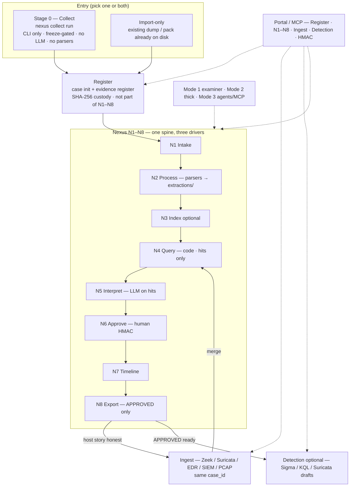
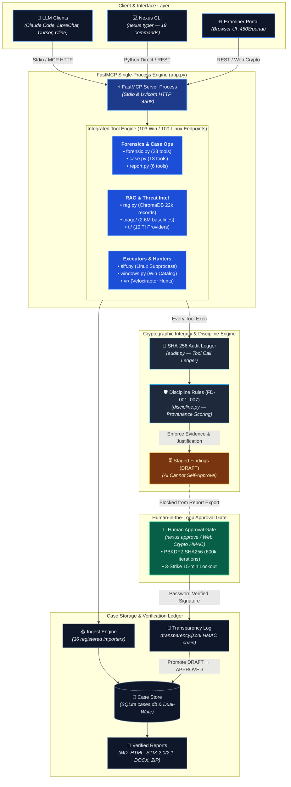

# DFIR-Nexus Architecture

> **Related:** [NEXUS-MODE.md](NEXUS-MODE.md) — operator loop · [CLI.md](CLI.md) —
> command surface · [guide.md](guide.md) — examiner workflow · [FAQ.md](FAQ.md) ·
> [../SECURITY.md](../SECURITY.md)

## Product spine (current)

This is the architecture the CLI and docs describe **now**. MCP tool counts and
the FastMCP process remain; they are the workstation behind the spine, not the
first door. Operator detail: [NEXUS-MODE.md](NEXUS-MODE.md).

```
Stage 0  Collect     nexus collect run     CLI only (portable; freeze-gated)
Register             case init + evidence register     custody; not N1–N8
N1–N8                intake → parsers → query → interpret → HMAC → report
Ingest               other logs onto the same case_id
Nexus again          N4→N8 on merged evidence (not re-collect / re-register)
Detection            optional drafts after APPROVED
```



| Surface | Role |
|---------|------|
| **`nexus collect`** | Live IR. Stays **CLI** — handy, headless, no browser. No parsers. No empty parser dirs on the target. |
| **Register** | SHA-256 pack into a case. Import-only cases skip collect. |
| **N2** | Hayabusa / Suzaku / Chainsaw / Zimmerman write CSVs under the case (`nexus pipeline --mode tools`). |
| **3 modes** | How you drive the same N1–N8 spine (examiner / thick / agents) — not extra stages. |
| **Ingest** | Other logs onto that case. Then re-query / interpret / HMAC / report (N4→N8). |
| **Detection** | Optional drafts after an APPROVED story. Not N5. |
| **Examiner Portal + MCP** | Investigation UI for Register, N1–N8, ingest, detection, HMAC. Collect does not move into the Portal. |
| **LLM** | Optional. Narrates **N4 hits** only. Cannot approve. Fully agentic tool-selection is a later mode. |

## Design Principle

**Single FastMCP process. Platform-aware. Multi-server capable.**

All tool modules import directly into one FastMCP server. Platform-specific
modules (SIFT tools for Linux, Windows tools for Windows) register only on
their native OS. For cross-platform deployments, run an instance on each
machine and configure the LLM client to connect to all of them.

## Topology



```
┌────────────────────────────────────────────────────────────────────────────┐
│                         DFIR-Nexus (single process)                        │
│                                                                             │
│  FastMCP("dfir-nexus")                                                      │
│                                                                             │
│  Universal modules (everywhere):                                            │
│   forensic.py — 23 tools  (findings, timeline, TODOs + 14 discipline)       │
│   case.py     — 13 tools  (case lifecycle, evidence, export, backup)        │
│   report.py   — 6 tools   (report generation, 6 profiles)                  │
│   rag.py      — 5 tools   (ChromaDB semantic search + download)             │
│   opencti.py  — 11 tools  (IOC/threat actor/malware/report lookup)          │
│   triage/     — 15 tools  (offline baseline validation + download)           │
│   analysis.py — 19 tools  (correlation, graphs, exports, detection helpers) │
│                                                                             │
│  Platform-gated (register only on matching OS):                             │
│   sift.py    — 7 tools  (Linux only — security-gated subprocess executor)   │
│   windows.py — 10 tools (Windows only — catalog-gated executor)             │
│                                                                             │
│  Infrastructure:                                                            │
│   audit.py         — SHA-256 audit logging (last_audit_id tracking)         │
│   auth.py          — Bearer token + password auth (PBKDF2 + HMAC ledger)    │
│   case_manager.py  — On-disk state: findings, timeline, evidence, IOCs      │
│   discipline.py    — Finding validation rules                               │
│   transparency.py  — Hash-chained transparency log (every commit appended)  │
│   dashboard/       — In-process Starlette Examiner Portal + REST API        │
│   config.py        — Pydantic settings (NEXUS_ env vars)                    │
│                                                                             │
└────────────────────────────────────────────────────────────────────────────┘
                           │
           ┌───────────────┴───────────────┐
           │ Stdio transport               │ HTTP transport
           │ (LLM spawns nexus)            │ (nexus serve --http)
           │                               │
    ┌──────▼──────┐                ┌───────▼────────┐
    │ LLM Client  │                │ uvicorn :4508  │
    │ (Claude,    │                │                │
    │  LibreChat) │                │ /mcp  — MCP    │
    └─────────────┘                │ /portal — Web  │
                                   └────────────────┘
```

## Multi-Server Deployment

For environments with multiple forensic machines:

```
┌──────────────────────────────────┐
│  LLM Client (Claude Code)        │
│  .mcp.json has both servers      │
└────────┬──────────────┬─────────┘
         │              │
         ▼              ▼
┌──────────────┐  ┌──────────────┐
│ SIFT (Linux) │  │ Windows      │
│ nexus serve  │  │ nexus serve  │
│ --http :4508 │  │ --http :4508 │
│              │  │              │
│ sift tools   │  │ windows tools│
│ case tools   │  │ case tools   │
│ rag, triage  │  │ rag, triage  │
│ opencti      │  │ opencti      │
└──────────────┘  └──────────────┘
```

Generated by: `nexus setup client --sift 10.0.0.2:4508 --windows 10.0.0.5:4508`

## Data Flow

### Standard investigation

```
nexus collect run …                    → pack on disk (no parsers)
    │
nexus case init + evidence register    → SHA-256 custody
    │
nexus pipeline --mode tools            → N2 parsers → extractions/ + audit_id
    │
nexus pipeline --mode interpret        → N4 hits → N5 DRAFT (optional LLM)
    │
nexus approve                          → HMAC; DRAFT → APPROVED
    │
nexus report generate                  → template from APPROVED only
```

MCP `run_command` / Portal Query remain for examiner extras on the same case.
The provenance chain below still applies to every tool call.

### Provenance chain

```
Tool execution → audit_id → record_finding(artifacts=[{audit_id}])
     │                                           │
     └──── SHA-256 hash ── audit/*.jsonl ─────────┘
                          verify audit_id exists
                          classify source (mcp/hook/shell/none)
                          grade provenance (FULL/PARTIAL/NONE)
```

## Security Model

| Layer | Control |
|-------|---------|
| Findings | DRAFT by default. Only `nexus approve` (CLI, password via getpass) or `/portal/api/commit` (browser, Web Crypto HMAC challenge-response) can change status. The LLM cannot approve. |
| Approvals | PBKDF2-SHA256 hashed passwords, HMAC verification ledger, 15-min lockout after 3 failed attempts |
| Transparency | Every commit (approval) is also appended to a hash-chained transparency log (`transparency.jsonl`). `transparency_verify()` walks the chain; a tampered case directory is detectable without trusting `~/.nexus/verification/` |
| Audit | Every tool call logged with SHA-256 hash. Findings must reference valid audit IDs from the active case |
| SIFT execution | Hardcoded denylist (25 binaries), argument sanitization, shell metacharacter blocking, input path validation |
| Windows execution | Hardcoded denylist + catalog allowlist, script auto-expansion, 24h result caching |
| HTTP mode | Bearer token authentication; expose publicly only behind a reverse proxy enforcing TLS |
| Bundle export | `nexus export --encrypt` uses PBKDF2 (600K iterations) + Fernet for encrypted at-rest case bundles |
| Provenance | `record_finding` rejects findings without valid `audit_id` in audit trail |
| Telemetry | OpenTelemetry tracing opt-in only (`NEXUS_OTEL_ENABLED=true`); off by default — no data leaves the host |

## Directory Layout

```
~/.nexus/
├── config.yaml              # Examiner config
├── active_case              # Pointer to active case (case_id or absolute path)
├── services.json            # Custom service registry for `nexus service`
├── passwords/               # PBKDF2-SHA256 password hashes (0o600)
├── verification/            # HMAC verification ledger (one file per approval)
├── cases/
│   ├── cases.db             # SQLite case stack (canonical persistence)
│   └── CASE-001/            # Legacy JSON compatibility case directory
│       ├── CASE.yaml
│       ├── findings.json
│       ├── timeline.json
│       ├── evidence_registry.json
│       ├── iocs.json
│       ├── approvals.jsonl
│       ├── transparency.jsonl  # Hash-chained log; every approval appended
│       ├── todos.json
│       ├── extractions/        # Tool output staging (allowed write target)
│       ├── reports/            # Generated reports
│       ├── .outputs/           # LLM scratch space (allowed write target)
│       └── audit/
│           ├── nexus.jsonl     # Tool-call audit (SHA-256 + provenance)
│           └── claude-code.jsonl  # Bash invocations from the skill bundle hook
└── data/
    ├── rag/                 # RAG index (ChromaDB)
    └── triage/              # Baseline databases (known_good.db, context.db)
```

`nexus-config.json` is written to the current working directory by
`nexus init` (LLM client config snippet — copy into `.mcp.json`).

## LLM Client Setup

```bash
# Single machine (stdio)
nexus serve

# Single machine (HTTP)
nexus serve --http --port 4508

# Multi-machine
nexus setup client --sift 10.0.0.2:4508 --windows 10.0.0.5:4508
# Generates .mcp.json + settings.json with deny rules protecting case files
```

For Claude Code specifically, the **`claude-code/` skill bundle** ships
a curated experience — CLAUDE.md system prompt, `case-data-guard.sh`
PreToolUse hook, `forensic-audit.sh` PostToolUse hook (writes Bash
invocations to `<case>/audit/claude-code.jsonl`), and slash commands
(`/welcome`, `/case`, `/approve`, `/report`). Two variants:

- `claude-code/lite/` — single-machine, one MCP allowlist entry
- `claude-code/full/` — multi-host fleet, sandbox + stricter denies

See [`../claude-code/README.md`](../claude-code/README.md).
