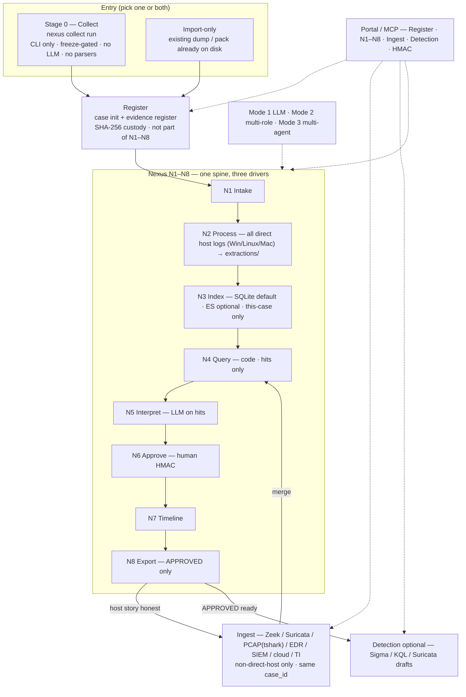

# DFIR-Nexus Architecture

> **Related:** [NEXUS-MODE.md](NEXUS-MODE.md) — operator loop · [CLI.md](CLI.md) —
> command surface · [guide.md](guide.md) — examiner workflow · [FAQ.md](FAQ.md) ·
> [../SECURITY.md](../SECURITY.md)

## Product spine (current)

This is the architecture the CLI and docs describe **now**. MCP tool counts and
the FastMCP process remain; they are the workstation behind the spine, not the
first door. Operator detail: [NEXUS-MODE.md](NEXUS-MODE.md).

```
Stage 0  Collect     nexus collect run     CLI only (portable; freeze-gated)
Register             case init + evidence register     custody; not N1–N8
N1–N8                intake → parsers → query → interpret → HMAC → report
Ingest               other logs onto the same case_id
Nexus again          N4→N8 on merged evidence (not re-collect / re-register)
Detection            optional drafts after APPROVED
```



| Surface | Role |
|---------|------|
| **`nexus collect`** | Live IR. Stays **CLI** — handy, headless, no browser. No parsers. No empty parser dirs on the target. |
| **Register** | SHA-256 pack into a case. Import-only cases skip collect. |
| **N2** | All direct host logs (Win/Linux/Mac): binary parsers (Hayabusa/Suzaku/Chainsaw/Zimmerman) + pre-collected host output (VR hunts, KAPE, Kansa, UAC, journalctl) → CSVs under the case with audit_id. Given a directory (pack or mounted VMDK) and recursively parses all host evidence. |
| **N3** | SQLite (default; deterministic CSV fallback) or Elasticsearch (required for the agentic depths and LLM interpretation). Per-case index, **schema v3**: `family/file/line/ts` + timestamp authority (`ts_raw/ts_src/ts_precision` + assumed flags) + structured `host/user/event_id` + parsed columns under `fields.*`. Query model by mode: **Mode 1 (LLM) = typed DSL** (every catalog column: `= != > >= < <=`, ranges, `exists:`, `in:(…)`, `ts` ranges; unknown fields are rejected) which pushes down to ES or evaluates on CSV, plus the ES-native tools in the steer chat; **Modes 2/3 agents = ES-native tools** (`es_fields`/`es_search`/`es_aggregate`/`es_sample`, allowlisted query JSON, exact totals, `search_after` paging, composite aggregations) — the DSL is not an agent surface there. Not the lab SIEM. |
| **3 modes** | How you drive the same N1–N8 spine (examiner / thick / agents) — not extra stages. |
| **Ingest** | Network/SIEM/cloud/EDR/PCAP onto that case (after N8). PCAP parsed via tshark. Direct host logs stay in N2. |
| **Detection** | Optional drafts after an APPROVED story. Not N5. |
| **Examiner Portal + MCP** | Investigation UI for Register, N1–N8, ingest, detection, HMAC. Collect does not move into the Portal. |
| **HTTP audit (4k.3)** | Every `/portal/api/*` (mutating always; reads at `NEXUS_HTTP_AUDIT=all`) and every `/mcp` call is recorded twice: rotating `logs/nexus-http-YYYYMMDD.log` and a hash-chained case entry in `audit/http.jsonl` (method/path/redacted query/status/duration/case). Failed ES tool calls are audited with their error. |
| **LLM** | Optional. Narrates **N4 hits** only. Cannot approve. Mode 2 adds a supervised multi-role pipeline (scoped read-only tools, one work order at a time — see below); Mode 3 adds the concurrent multi-agent board. Neither stages or approves; DRAFT staging is an examiner action. |

## Design Principle

**Single FastMCP process. Platform-aware. Multi-server capable.**

All tool modules import directly into one FastMCP server. Platform-specific
modules (SIFT tools for Linux, Windows tools for Windows) register only on
their native OS. For cross-platform deployments, run an instance on each
machine and configure the LLM client to connect to all of them.

## Topology


```
┌────────────────────────────────────────────────────────────────────────────┐
│                         DFIR-Nexus (single process)                        │
│                                                                             │
│  FastMCP("dfir-nexus")                                                      │
│                                                                             │
│  Universal modules (everywhere):                                            │
│   forensic.py — 23 tools  (findings, timeline, TODOs + 14 discipline)       │
│   case.py     — 13 tools  (case lifecycle, evidence, export, backup)        │
│   report.py   — 6 tools   (report generation, 6 profiles)                  │
│   rag.py      — 5 tools   (ChromaDB semantic search + download)             │
│   opencti.py  — 11 tools  (IOC/threat actor/malware/report lookup)          │
│   triage/     — 15 tools  (offline baseline validation + download)           │
│   analysis.py — 19 tools  (correlation, graphs, exports, detection helpers) │
│                                                                             │
│  Platform-gated (register only on matching OS):                             │
│   sift.py    — 7 tools  (Linux only — security-gated subprocess executor)   │
│   windows.py — 10 tools (Windows only — catalog-gated executor)             │
│                                                                             │
│  Infrastructure:                                                            │
│   audit.py         — SHA-256 audit logging (last_audit_id tracking)         │
│   auth.py          — Bearer token + password auth (PBKDF2 + HMAC ledger)    │
│   case_manager.py  — On-disk state: findings, timeline, evidence, IOCs      │
│   discipline.py    — Finding validation rules                               │
│   transparency.py  — Hash-chained transparency log (every commit appended)  │
│   dashboard/       — In-process Starlette Examiner Portal + REST API        │
│   config.py        — Pydantic settings (NEXUS_ env vars)                    │
│                                                                             │
└────────────────────────────────────────────────────────────────────────────┘

### Ledger & approval architecture (4 ledgers, 2 approval stacks)

DFIR-Nexus maintains **4 separate ledgers** and **2 approval stacks**. They are
intentionally distinct — each serves a different audit purpose. They are **not**
one unified chain.

**Ledgers:**

| Ledger | File | Format | Purpose |
|--------|------|--------|---------|
| **Audit JSONL** | `{case_dir}/audit/{mcp_name}.jsonl` | JSONL + `audit_id` | Per-tool-call audit trail. Every MCP tool execution gets a unique `audit_id`. Findings must reference real `audit_id`s (fabricated IDs are rejected by discipline rules). |
| **Transparency chain** | `{case_dir}/transparency.jsonl` | HMAC-chained JSONL | Hash-chained log of every approval commit. Each entry links to the previous entry's hash — tampering breaks the chain. |
| **Verification ledger** | `{case_dir}/verification.jsonl` | HMAC entries | PBKDF2/HMAC password verification records. `auth.py:reset_password` re-HMACs all entries when the password changes. Used by the challenge-response approval flow. |
| **Case SQLite store** | `{cases_root}/cases.db` | SQLite tables | Structured case state: findings, evidence, timeline, IOCs, TODOs. Dual-write: JSON files on disk + SQLite for query. |

**Approval stacks:**

| Stack | Location | Used by | Status |
|-------|----------|---------|--------|
| **Dashboard HMAC flow** | `auth.py` + `dashboard/app.py` | Portal `/portal/api/commit/challenge` + `/commit` + `/mode3/seal` | **Active** — the primary examiner approval path. Challenge-response: server issues nonce → examiner computes `HMAC-SHA256(PBKDF2(password, salt, 600000), nonce)` → server verifies. |
| **Case module ApprovalWorkflow** | `case/approval.py:ApprovalWorkflow` | `case/` module internals only | **Legacy** — not wired into the Portal dashboard. Retained for CLI-path and programmatic API use. `get_default_workflow()` returns a singleton with process-level lockout. |

**Design note:** The two approval stacks share the same PBKDF2-HMAC-SHA256
cryptographic primitives but maintain separate code paths. The Portal dashboard
uses `auth.py` directly (challenge-response, never sends password). The
`case/approval.py` workflow wraps the same crypto in a class-based API for
programmatic consumers. They are **not** the same chain — the transparency log
chains approval commits, not password verifications.
                           │
           ┌───────────────┴───────────────┐
           │ Stdio transport               │ HTTP transport
           │ (LLM spawns nexus)            │ (nexus serve --http)
           │                               │
    ┌──────▼──────┐                ┌───────▼────────┐
    │ LLM Client  │                │ uvicorn :4508  │
    │ (Claude,    │                │                │
    │  LibreChat) │                │ /mcp  — MCP    │
    └─────────────┘                │ /portal — Web  │
                                   └────────────────┘
```

## Multi-Server Deployment

For environments with multiple forensic machines:

```
┌──────────────────────────────────┐
│  LLM Client (Claude Code)        │
│  .mcp.json has both servers      │
└────────┬──────────────┬─────────┘
         │              │
         ▼              ▼
┌──────────────┐  ┌──────────────┐
│ SIFT (Linux) │  │ Windows      │
│ nexus serve  │  │ nexus serve  │
│ --http :4508 │  │ --http :4508 │
│              │  │              │
│ sift tools   │  │ windows tools│
│ case tools   │  │ case tools   │
│ rag, triage  │  │ rag, triage  │
│ opencti      │  │ opencti      │
└──────────────┘  └──────────────┘
```

Generated by: `nexus setup client --sift 10.0.0.2:4508 --windows 10.0.0.5:4508`

## Data Flow

### Standard investigation

```
nexus collect run …                    → pack on disk (no parsers)
    │
nexus case init + evidence register    → SHA-256 custody
    │
nexus pipeline --mode tools            → N2 all direct host logs (Win/Linux/Mac)
                                         parsers + pre-collected host output
                                         → extractions/ + audit_id
                                         (given a directory: pack or mounted VMDK)
    │
nexus pipeline --mode interpret        → N4 hits → N5 DRAFT (optional LLM)
    │
nexus approve                          → HMAC; DRAFT → APPROVED
    │
nexus report generate                  → template from APPROVED only
    │
ingest (after N8)                      → Zeek/Suricata/PCAP(tshark)/EDR/SIEM/cloud/TI
                                         onto same case_id (non-direct-host only)
    │
N4→N8 again                            → re-query merged host + network evidence
```

MCP `run_command` / Portal Query remain for examiner extras on the same case.
The provenance chain below still applies to every tool call.

### Provenance chain

```
Tool execution → audit_id → record_finding(artifacts=[{audit_id}])
     │                                           │
     └──── SHA-256 hash ── audit/*.jsonl ─────────┘
                          verify audit_id exists
                          classify source (mcp/hook/shell/none)
                          grade provenance (FULL/PARTIAL/NONE)
```

## Security Model

| Layer | Control |
|-------|---------|
| Findings | DRAFT by default. Only `nexus approve` (CLI, password via getpass) or `/portal/api/commit` (browser, Web Crypto HMAC challenge-response) can change status. The LLM cannot approve. |
| Approvals | PBKDF2-SHA256 hashed passwords, HMAC verification ledger, 15-min lockout after 3 failed attempts |
| Transparency | Every commit (approval) is also appended to a hash-chained transparency log (`transparency.jsonl`). `transparency_verify()` walks the chain; a tampered case directory is detectable without trusting `~/.nexus/verification/` |
| Audit | Every tool call logged with SHA-256 hash. Findings must reference valid audit IDs from the active case |
| SIFT execution | Hardcoded denylist (25 binaries), argument sanitization, shell metacharacter blocking, input path validation |
| Windows execution | Hardcoded denylist + catalog allowlist, script auto-expansion, 24h result caching |
| HTTP mode | Bearer token authentication; expose publicly only behind a reverse proxy enforcing TLS |
| Bundle export | `nexus export --encrypt` uses PBKDF2 (600K iterations) + Fernet for encrypted at-rest case bundles |
| Provenance | `record_finding` rejects findings without valid `audit_id` in audit trail |
| Telemetry | OpenTelemetry tracing opt-in only (`NEXUS_OTEL_ENABLED=true`); off by default — no data leaves the host |

## Directory Layout

```
~/.nexus/
├── config.yaml              # Examiner config
├── active_case              # Pointer to active case (case_id or absolute path)
├── services.json            # Custom service registry for `nexus service`
├── passwords/               # PBKDF2-SHA256 password hashes (0o600)
├── verification/            # HMAC verification ledger (one file per approval)
├── cases/
│   ├── cases.db             # SQLite case stack (canonical persistence)
│   └── CASE-001/            # Legacy JSON compatibility case directory
│       ├── CASE.yaml
│       ├── findings.json
│       ├── timeline.json
│       ├── evidence_registry.json
│       ├── iocs.json
│       ├── approvals.jsonl
│       ├── transparency.jsonl  # Hash-chained log; every approval appended
│       ├── todos.json
│       ├── extractions/        # Tool output staging (allowed write target)
│       ├── reports/            # Generated reports
│       ├── .outputs/           # LLM scratch space (allowed write target)
│       └── audit/
│           ├── nexus.jsonl     # Tool-call audit (SHA-256 + provenance)
│           └── claude-code.jsonl  # Bash invocations from the skill bundle hook
└── data/
    ├── rag/                 # RAG index (ChromaDB)
    └── triage/              # Baseline databases (known_good.db, context.db)
```

`nexus-config.json` is written to the current working directory by
`nexus init` (LLM client config snippet - copy into `.mcp.json`).

### Framework knowledge registries (2026-09)

`src/nexus/data/knowledge/{itm,attack,atlas,mbc}/` hold compiled registries
(vendored upstreams; attribution in each folder's `NOTICE.txt`):

- **Insider Threat Matrix** — 183 sections / 776 detections / 610 preventions /
  168 ATT&CK crosswalk maps (plus `attack_patterns_itm.yaml` chains and
  `needles/itm_needles.yaml` packs);
- **MITRE ATT&CK deep** — 1,140 techniques / 918 detection strategies /
  1,390 analytics / 1,744 mitigations / 3,499 procedure examples;
- **MITRE ATLAS** — 170 AI/ML techniques / 35 mitigations / 57 case studies;
- **MITRE MBC v3** — 150 behaviors / 482 methods / 50 families / 1,160
  capa-YARA rule references (mapped from capa output in Mode 1 context).

They feed Mode 1 (scribe context + signal-map needles behind a vocabulary
gate, steer/proposal prompts, interpretation), Modes 2/3 (work-order planning,
pattern seats, `_registry_context_block`), the report (per-stage ITM
coverage + registry facts) and `nexus doctor` (manifest). Rebuild with
`scripts/build_*_registry.py`; raw dumps are gitignored and excluded from
wheels.

### Mode 2 supervised multi-role runtime (runtime `mode3`, 2026-09)

`src/nexus/modes/multi_role.py` is the Mode 2 supervised execution layer
(M1–M7). It is a LangGraph `StateGraph` supervisor over the shared bounded
tool loop — there is no second bespoke agent loop. It is **multi-role, not
concurrent multi-agent**: one work order runs at a time.

- **Roles** (`AgentRole`): director, evidence, correlation, pattern, verifier,
  synthesis, reporter — each with a scoped **read-only** tool allowlist,
  system prompt, budget (rounds/calls/seconds) and deterministic honest
  fallback. The allowlist is enforced by `context_loop.allowed_tools`.
- **Work orders** (`WorkOrder`): task, family, priority tools, expected
  artifact/event IDs, acceptance signal, negative-evidence rule, and
  `skill_refs` (KB skill id + content version + citations) rendered into the
  prompt as step queries.
- **Graph**: `director → worker(s) → verify → assess → synthesis`, with a
  `pause`/halt node. `assess` appends follow-up orders for inferred or
  refuted candidates (`NEXUS_MODE2_FOLLOWUPS`, default 8, up to 24) and stops
  early on `converged_no_new_evidence`. Each worker receives the attached KB
  skill procedures and the prior agents' notes, packed to the case context
  window. Examiner findings-feedback (approved → deepen, rejected →
  exclusion, draft → de-dup) is read at plan time.
- **Events** (`AgentEvent`): one envelope (`run_id/turn_id/agent_id/call_id`,
  tool/why/audit_id/status/detail) persisted to
  `analysis/mode2_runs/<run_id>.jsonl` and streamed over SSE
  (`GET /portal/api/mode3/run/events`). Examiner controls (pause/stop) live in
  a `.control.json` sidecar the graph never writes, so a state persist can
  never clobber a fresh request.
- **Run record**: `analysis/mode2_runs/<run_id>.json` (orders, results,
  verdicts, candidates, coverage, follow-up count) is the resumable
  checkpoint; `nexus mode3` and the Agent Run page are two surfaces over the
  same runtime.
- **Boundary**: agents never stage or approve. Candidates stage as DRAFT only
  through the examiner action `nexus mode2 stage` / `POST /mode2/run/stage`,
  which requires real audit IDs (FD-001) and persists `run_id` /
  `input_call_ids` lineage. Approval stays password-gated in the Approval Desk.

### Mode 3 concurrent multi-agent runtime (2026-09)

`src/nexus/modes/multi_agent.py` is the concurrent layer: a
`StateGraph` with channel reducers (`board: Annotated[list, add_board]`), a
supervisor node (model-chosen seats, deterministic fallback) that uses
LangGraph `Send` to fan out evidence / correlation / pattern seats **in one
superstep**, a join that groups audit-backed claims by
`(entity_type, entity_value, claim_kind)`, opens disputes and re-dispatches
bounded, and synthesis that turns settled claims into DRAFT candidates.
Unresolved disputes are gaps, never findings. One `AuditWriter`/`EventSink`
per run (shared across seats); a run governor caps agents / supersteps / calls
/ seconds; pause / stop / steer apply at superstep boundaries with a
file-based `resume_state`. Surfaces: `nexus mode3`,
`/portal/api/mode3/run*`, and the **Investigation Board** on Agent Run.

## LLM Client Setup

```bash
# Single machine (stdio)
nexus serve

# Single machine (HTTP)
nexus serve --http --port 4508

# Multi-machine
nexus setup client --sift 10.0.0.2:4508 --windows 10.0.0.5:4508
# Generates .mcp.json + settings.json with deny rules protecting case files
```

For agent integrations, agent-only guidance lives at the repo root
(`AGENTS.md`, `FORENSIC-DISCIPLINE.md` — gitignored, local only).
`AGENTS.md` is the canonical agent reference; `FORENSIC-DISCIPLINE.md`
is the human-readable mirror of the FD-001..007 rules whose
authoritative source is `src/nexus/data/knowledge/discipline/rules.yaml`
(queryable via the `get_rules()` MCP tool).
