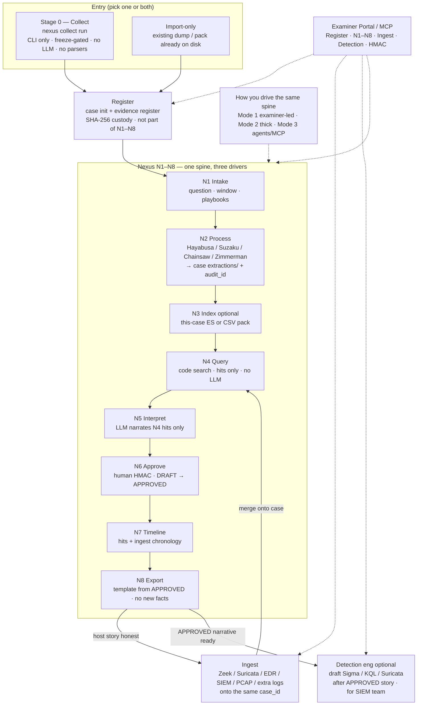

# Nexus mode (the investigation loop)

This page is the operator mental model. Open it first: collect → register → N1–N8.

One product, three doors, one `case_id`:

1. **Nexus mode** (this page) — host pack: process, query, interpret, approve, export
2. **Import/ingest** — Zeek, Suricata, EVTX, EDR/SIEM export onto the **same** case
3. **Detection eng** — after the story: draft Sigma/KQL/Suricata for the SIEM team

Do import and detection **after** Nexus mode is honest on one pack.
They reuse the same query / HITL / report brain. They do not replace it.

## Stage 0 — live collect (before Register)

Stage 0 is a **live run** against a host you can authenticate to:

`nexus collect run --os windows --host <ip> --user <acct> --identity <key>`

**`--profile disk` is the default ship spine** (current Windows 11 / modern Linux):
Windows KAPE + Sysinternals + PersistenceSniper + wevtutil + Velociraptor IRTriage;
Linux POSIX volatile + journalctl + UAC `ir_triage` + Velociraptor LinuxIRTriage.
`--profile full` wraps extra *collectors* (Kansa, DFIR-ORC, WinPmem/AVML, UAC `full`)
and **skips with a reason** when a tool is missing or broken. It does **not** run
Hayabusa / Suzaku / Chainsaw — those parse collected EVTX at **N2**.
Writes `hosts/<hostname>/…` + `manifest.json`. **Not** an analysis dump.

Then **Register** (separate from N1–N8): `nexus case init` and
`nexus evidence register` the pack. After that, N2 parsers and N1–N8
run in examiner / thick / agents mode against the same `case_id`.

`nexus collect import <dump>` is the helper when you already have a KAPE image or
Kansa CSVs. Velociraptor is a **Stage 0 collector**: skipped honestly when the
server is mock or unreachable; live hunts run when examiner `.env` has
`NEXUS_VR_MCP_URL` + `NEXUS_VR_MCP_API_KEY` (HTTP `:8002`, not gRPC `:8001`).
See [SETUP.md §2.6](SETUP.md#26-live-velociraptor-hunts-every-examiner-host).
`nexus collect run` harvests — wait for operator freeze. Opt into overlap with
`--profile full`. Opt out with `--profile volatile`, `--only kansa,kape`,
or `--no-*`.

Without SSH or WinRM (or local) credentials, collection does not run. That is
the orchestrator boundary.

## Register stays outside N1–N8

Do **not** fold Register into N1–N8. Custody is a gate, not analysis.

| Activity | What it is |
|----------|------------|
| **Stage 0 Collect** | Live IR → pack on disk. No case required. No LLM. No parsers. |
| **Register** | `nexus case init` + `nexus evidence register <pack>`. HMAC / chain-of-custody. Also used for import-only cases (no collect). |
| **N1–N8** | Analysis spine on a registered `case_id`. Examiner / thick / agents are *how you drive* that spine, not extra stages. |
| **N2** | Parsers (Hayabusa / Suzaku / Chainsaw + Zimmerman) write CSVs under the case. |

Why Register is separate:

- Import-only cases must register without collect.
- Re-running N2 must not re-register.
- The three Nexus modes all need an existing `case_id`. Mixing Register into N1 makes Mode 2/3 awkward.

One collect command. Follow-up is **separate CLI commands**, not one mega-script.

A case is stable across retries. Each tools, coverage, design, or interpret execution creates an immutable `runs/<run_id>/` directory containing that execution's extractions, ledger, analysis, and reports. `active_runs.json` selects the current tools and interpretation runs without overwriting earlier output. Register unchanged evidence once; a changed pack must be preserved at a new path and registered as new evidence.

## Surfaces (CLI vs UI)

| Surface | What |
|---------|------|
| **Collect** | Stays **CLI** (`nexus collect`). Portable, headless, freeze-gated. No Portal harvest. |
| **Register + N1–N8 + ingest + detection** | CLI **and** Examiner Portal / MCP. Portal is the investigation desk. |

Do not put live IR behind a browser. Do not skip Register because the Portal can open a case.

## Product flow (canonical)

One product, one `case_id`. Stage 0 is skippable for import-only cases. Register is not.
The three Nexus modes are **how you drive** N1–N8 — not extra stages after N8.
After ingest, “Nexus again” means re-run **N4→N8** on merged evidence — not collect / register / N2 from scratch.



### How to read it

| Step | What it is | What it is not |
|------|------------|----------------|
| **Stage 0** | Live IR → pack on disk | Analysis, parsers, Portal harvest |
| **Register** | Custody gate into a case | An N1–N8 step |
| **N1–N8** | The investigation brain | Three separate products |
| **3 modes** | *How* you drive N1–N8 | Extra stages after N8 |
| **Ingest** | Other logs onto **that** case | A second collect / re-register |
| **Nexus again** | Re-run **N4→N8** on merged evidence | Collect / Register / N2 from scratch |
| **Detection** | Optional drafts after APPROVED | Required next click; not N5 |

### Happy path (host first, then network)

```text
Collect (CLI) ──► Register ──► N1→N2→N3→N4→N5→N6→N7→N8
                                      │
                                      ▼ (optional)
                                   Ingest logs
                                      │
                                      ▼
                              N4→N5→N6→N7→N8 again
                                      │
                                      ▼ (optional)
                              Detection drafts (D1)
```

### Import-only shortcut

```text
Existing dump ──► Register ──► N1–N8 ──► (Ingest?) ──► (Detection?)
```

### N1–N8 spine (locked)

```
N1  Intake     examiner question + window + playbooks
N2  Process    parsers write CSVs + audit_id     (Hayabusa/Suzaku/Chainsaw here)
N3  Index      optional ES of THIS case's output (no LLM)
N4  Query      code searches processed output    (no LLM)
N5  Interpret  LLM narrates N4 hits only
N6  Approve    human HMAC; reject / redirect
N7  Timeline   chronology from hits + ingest
N8  Export     Python template from APPROVED     (no new facts)
D1  Optional   draft detections after N8
```

Facts never come from the model. Hits come from N4. Findings cite hits.
Empty hits = INSUFFICIENT, not a coverage gap, not a fake story.

Continuous improvement (AI forensics, better parsers, playbooks, RAG) lands **inside**
N1–N8 — not as a parallel product.

## Who runs N4 query?

N4 is **search code**, not a chat. Three callers, one function (`n4_hits`):

1. **Playbooks (automatic).** YAML `query_terms` plus tokens from the
   examiner question. Host-compromise / attacker-activity questions load
   execution, persistence, log-tamper, and credential playbooks — not only
   malware family names (mimikatz/beacon). This is the default pack
   `analysis/query_pack.md` that N5 reads. N3 indexes Hayabusa-sized CSVs
   (needle rows); it must not fill the budget with RDP-cache tiles.
2. **Examiner (visual + CLI).** Portal **Query** tab, or
   `nexus case query --needles sdelete,.pst`. You are hunting in
   **already-parsed** CSVs / the case ES index — not in `Evidence-files/`.
3. **Agent / LLM (MCP).** Tool `query_case_hits`. The model may **propose**
   needles from playbooks/RAG. The tool **executes** the search. Empty
   result means stop, do not invent a row.

The LLM does not grep raw disks. It does not treat RAG snippets as evidence.

## Knowledge YAML vs RAG

**YAML** (`src/nexus/data/knowledge/`):

- Artifact cards: where the file lives, which parser
- Playbooks: what to **query** after parse (`query_terms` + Identify/Content steps)
- This is the forensic checklist. It will get better when SANS extracts land.
  Do not bake Rocba plot into prompts.

**RAG** (`forensic_rag_search`, Chroma, downloadable index):

- Methodology only (Sigma, ATT&CK, KAPE cards, LOLBAS)
- Used at N5, scoped to hit families (prefetch, LNK, SRUM, …)
- Never an `audit_id`. Never a substitute for a CSV row.

`tools` mode does not load RAG. Process first, query second, interpret third.

## Tools vs design (do not skip the lane)

`tools` is the mandatory parser pass for **present** artifacts. FAIL = the
parser ran and lost (timeout/error). SKIP = artifact absent, or SIFT was never
configured (Windows-only MCP does not fake a SIFT SKIP). The LLM does not
choose this set.

`design` (agentic) runs **the same lane first**. ReAct may then add extras
(carve, extra Volatility plugins). Agentic must not paper over a FAIL by
omitting the parser. Extras after the lane, not instead of it.

## If the analysis is wrong (N6)

Do not re-parse a good ledger. Redirect:

1. Reject the DRAFT (or leave it DRAFT).
2. Add needles: `nexus case query --needles Prefetch,sdelete --persist`
   or Portal Query, or `query_case_hits(..., persist=true)`.
3. Re-run interpret only:
   `nexus pipeline --mode interpret --from-case INC-...`
4. New DRAFTs. Approve what is supported. INSUFFICIENT is valid.

HITL is the accuracy gate. Lab auto-approve is not 12-pass HITL.

## Report (N8)

`REPORT.md` is a **template** (`dfir_report.py`) filled from APPROVED
findings + N7 timeline. The LLM already wrote observation vs interpretation
at N5. It does not write the file.

Before HMAC, open `reports/REPORT-DRAFT.md` — same template with DRAFT
findings and a PREVIEW watermark. `nexus report generate` writes that
preview when nothing is APPROVED yet. Tools mode writes `TOOL-RUN.md`
only; it must not overwrite `REPORT.md`.

Polish later may rephrase headings. It must not add hosts, times, or
malware names that are not in APPROVED hits. Prefer examiner edits
in the portal / markdown over a second model pass.

## CLI cheat sheet

```
# once: .env, SSH keys, nexus doctor
nexus collect run --os windows --host <ip> --user analyst --identity ~/.ssh/id
nexus case init "IR host"
nexus evidence register <pack>
nexus pipeline --mode tools --case <pack>
nexus pipeline --mode interpret --from-case INC-...
nexus case query --needles sdelete,.pst
nexus approve --examiner e2e_host F-021
nexus report generate
```

Portal: Steer (intake) → Query (hits) → Findings → Approve → Timeline.

## Beside the loop (workstation — not a second product)

N1–N8 is the investigation brain. Same case, same HMAC, examiner/agent may also call:

- Windows/SIFT catalogs (`run_windows_command` / `run_command`) — N2
- Triage `check_*` — known-good vs UNKNOWN (neutral)
- TI `ti_*` — IOC feeds (no OpenCTI required)
- Sigma library search/translate — not architecture D1 drafts
- VR hunts — mock offline; live = VR-GATE
- FK `get_*` — YAML methodology via MCP (RAG is still Chroma at N5)

OpenCTI is **parked**. Elasticsearch (`nexus-es`) searches **this case’s parsed rows**. OpenCTI would search an org CTI graph about an IOC taken *from* those rows. Different job.

Parser contract (public): [TOOL-EVIDENCE-MAP.md](cases/TOOL-EVIDENCE-MAP.md).
What shipped: [CHANGELOG.md](../CHANGELOG.md).

Examiner hosts keep a gitignored `Docs/internal/` tree (ship ledger, old-vs-new, live backlog). Those files are not in the public clone.
