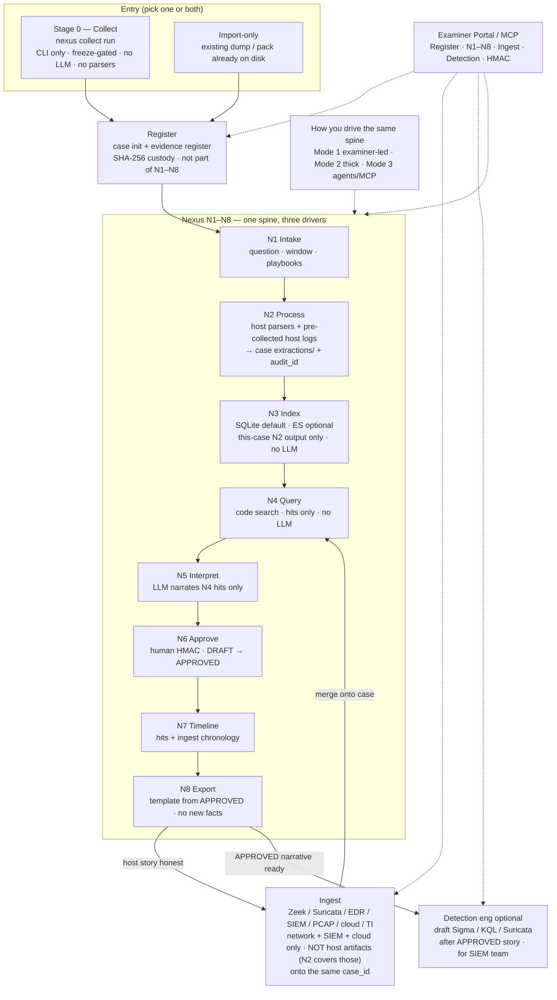

# Nexus mode (the investigation loop)

This page is the operator mental model. Open it first: collect → register → N1–N8.

One product, three doors, one `case_id`:

1. **Nexus mode** (this page) — host pack: process, query, interpret, approve, export
2. **Import/ingest** — Zeek, Suricata, EVTX, EDR/SIEM export onto the **same** case
3. **Detection eng** — after the story: draft Sigma/KQL/Suricata for the SIEM team

Do import and detection **after** Nexus mode is honest on one pack.
They reuse the same query / HITL / report brain. They do not replace it.

## Stage 0 — live collect (before Register)

Stage 0 is a **live run** against a host you can authenticate to:

`nexus collect run --os windows --host <ip> --user <acct> --identity <key>`

**`--profile disk` is the default ship spine** (current Windows 11 / modern Linux):
Windows KAPE + Sysinternals + PersistenceSniper + wevtutil + Velociraptor IRTriage;
Linux POSIX volatile + journalctl + UAC `ir_triage` + Velociraptor LinuxIRTriage.
`--profile full` wraps extra *collectors* (Kansa, DFIR-ORC, WinPmem/AVML, UAC `full`)
and **skips with a reason** when a tool is missing or broken. It does **not** run
Hayabusa / Suzaku / Chainsaw — those parse collected EVTX at **N2**.
Writes `hosts/<hostname>/…` + `manifest.json`. **Not** an analysis dump.

Then **Register** (separate from N1–N8): `nexus case init` and
`nexus evidence register` the pack. After that, N2 parsers and N1–N8
run in examiner / thick / agents mode against the same `case_id`.

`nexus collect import <dump>` is the helper when you already have a KAPE image or
Kansa CSVs. Velociraptor is a **Stage 0 collector**: skipped honestly when the
server is mock or unreachable; live hunts run when examiner `.env` has
`NEXUS_VR_MCP_URL` + `NEXUS_VR_MCP_API_KEY` (HTTP `:8002`, not gRPC `:8001`).
See [SETUP.md §2.6](SETUP.md#26-live-velociraptor-hunts-every-examiner-host).
`nexus collect run` harvests — wait for operator freeze. Opt into overlap with
`--profile full`. Opt out with `--profile volatile`, `--only kansa,kape`,
or `--no-*`.

Without SSH or WinRM (or local) credentials, collection does not run. That is
the orchestrator boundary.

## Register stays outside N1–N8

Do **not** fold Register into N1–N8. Custody is a gate, not analysis.

| Activity | What it is |
|----------|------------|
| **Stage 0 Collect** | Live IR → pack on disk. No case required. No LLM. No parsers. |
| **Register** | `nexus case init` + `nexus evidence register <pack>`. HMAC / chain-of-custody. Also used for import-only cases (no collect). |
| **N1–N8** | Analysis spine on a registered `case_id`. Examiner / thick / agents are *how you drive* that spine, not extra stages. |
| **N2** | Parsers (Hayabusa / Suzaku / Chainsaw + Zimmerman) write CSVs under the case. Also ingests pre-collected host logs (VR hunts, KAPE, Kansa, UAC, PersistenceSniper) as N2 extractions with audit_id. |
| **N3** | SQLite (default) or ES (optional) index of this case's N2 output. Not the lab SIEM. |

Why Register is separate:

- Import-only cases must register without collect.
- Re-running N2 must not re-register.
- The three Nexus modes all need an existing `case_id`. Mixing Register into N1 makes Mode 2/3 awkward.

One collect command. Follow-up is **separate CLI commands**, not one mega-script.

A case is stable across retries. Each tools, coverage, design, or interpret execution creates an immutable `runs/<run_id>/` directory containing that execution's extractions, ledger, analysis, and reports. `active_runs.json` selects the current tools and interpretation runs without overwriting earlier output. Register unchanged evidence once; a changed pack must be preserved at a new path and registered as new evidence.

## Surfaces (CLI vs UI)

| Surface | What |
|---------|------|
| **Collect** | Stays **CLI** (`nexus collect`). Portable, headless, freeze-gated. No Portal harvest. |
| **Register + N1–N8 + ingest + detection** | CLI **and** Examiner Portal / MCP. Portal is the investigation desk. |

Do not put live IR behind a browser. Do not skip Register because the Portal can open a case.

## Product flow (canonical)

One product, one `case_id`. Stage 0 is skippable for import-only cases. Register is not.
The three Nexus modes are **how you drive** N1–N8 — not extra stages after N8.
After ingest, “Nexus again” means re-run **N4→N8** on merged evidence — not collect / register / N2 from scratch.



### How to read it

| Step | What it is | What it is not |
|------|------------|----------------|
| **Stage 0** | Live IR → pack on disk | Analysis, parsers, Portal harvest |
| **Register** | Custody gate into a case | An N1–N8 step |
| **N2** | Host parsers + pre-collected host logs → CSVs + audit_id | Network/SIEM/cloud (that is ingest, after N8) |
| **N3** | SQLite/ES index of this case's N2 output | The lab SIEM; a global ES store |
| **N1–N8** | The investigation brain | Three separate products |
| **3 modes** | *How* you drive N1–N8 | Extra stages after N8 |
| **Ingest** | Network/SIEM/cloud logs onto **that** case (after N8) | A second collect / re-register / host-artifact re-parse |
| **Nexus again** | Re-run **N4→N8** on merged evidence | Collect / Register / N2 from scratch |
| **Detection** | Optional drafts after APPROVED | Required next click; not N5 |

### Happy path (host first, then network)

```text
Collect (CLI) ──► Register ──► N1→N2→N3→N4→N5→N6→N7→N8
                                      │
                                      ▼ (optional)
                                   Ingest logs
                                      │
                                      ▼
                              N4→N5→N6→N7→N8 again
                                      │
                                      ▼ (optional)
                              Detection drafts (D1)
```

### Import-only shortcut

```text
Existing dump ──► Register ──► N1–N8 ──► (Ingest?) ──► (Detection?)
```

### N1–N8 spine (locked)

```
N1  Intake     examiner question + window + playbooks
N2  Process    host parsers + pre-collected host logs → CSVs + audit_id
N3  Index      ES or SQLite index of THIS case's N2 output (no LLM)
N4  Query      code searches processed output    (no LLM)
N5  Interpret  LLM narrates N4 hits only
N6  Approve    human HMAC; reject / redirect
N7  Timeline   chronology from hits + ingest
N8  Export     Python template from APPROVED     (no new facts)
D1  Optional   draft detections after N8
```

Facts never come from the model. Hits come from N4. Findings cite hits.
Empty hits = INSUFFICIENT, not a coverage gap, not a fake story.

Continuous improvement (AI forensics, better parsers, playbooks, RAG) lands **inside**
N1–N8 — not as a parallel product.

### N2 — host parser lane (what it covers, what it does not)

N2 is the **deterministic host-artifact lane**. It has two jobs:

1. **Run external binary parsers** against raw host artifacts in the registered
   pack — Hayabusa, Suzaku, Chainsaw, EvtxECmd (EVTX), PECmd (prefetch),
   MFTECmd (MFT), RECmd (registry), AmcacheParser, AppCompatCacheParser,
   SBECmd (shellbags), LECmd/JLECmd (LNK/jumplists), autorunsc, BitsParser,
   SRUM, Volatility (memory). Each tool writes CSVs to
   `runs/<run_id>/extractions/` and gets an `audit_id` in the HMAC chain.

2. **Ingest pre-collected host logs** that Stage 0 already gathered as
   structured output — Velociraptor IRTriage / LinuxIRTriage JSON hunts,
   KAPE CSV modules, Kansa CSV output, PersistenceSniper CSV, Sysinternals
   output, UAC `ir_triage` output, DFIR-ORC exports, journalctl exports.
   These are host artifacts that Stage 0 collected; they belong in N2, not
   in the post-N8 ingest lane.

**If Stage 0 already produced parsed CSV/JSON output** (e.g. Hayabusa was run
during collection, or KAPE modules already emitted CSVs), N2 should detect
the pre-parsed output, **skip the redundant binary parser run**, register the
existing CSVs as N2 extractions with `audit_id`, and proceed to N3. The
examiner does not pay for a second Hayabusa pass on already-timelined EVTX.

**What N2 does NOT cover:**

- Network telemetry (Zeek, Suricata, Wireshark, Sysdig)
- SIEM exports (Elastic, Splunk, SecurityOnion, Wazuh, SocRates)
- Cloud logs (Azure, CloudTrail, M365)
- Threat-intel feeds (AbuseIPDB, MISP, OTX, ThreatFox, VirusTotal)
- Linux system logs not in the Stage 0 pack (auditd, authlog, syslog from
  a separate SIEM export — not the journalctl that Stage 0 already collected)

Those are the **ingest lane** (below), which runs after the first N1–N8 pass.

### N3 — case index (not optional in practice)

N3 indexes **this case's N2 extractions** so N4 can query large CSVs without
linear-scanning every file. Two backends:

| Backend | When | Storage |
|---------|------|---------|
| **SQLite** | Default. Always available, no external service. | `runs/<run_id>/analysis/case_index.sqlite` |
| **Elasticsearch** | When `NEXUS_ES_URL` is set and reachable. | Per-case ES index `nexus-case-<case_id>` |

SQLite is the **offline-first default**. It loads N2 CSVs into a local
per-case SQLite database with the same schema as the ES index
(`case_id`, `family`, `file`, `line`, `text`, `ts`). N4 query hits the
SQLite index first; if ES is available and has the case index, N4 can use
it for larger/faster wildcard searches.

ES is **not** the CADRE lab SIEM (`192.168.77.50` / `elk`). N3 must not
point at the lab SIEM — it is a per-case working index, not a global
security monitoring store. See `case_index.py` guard.

N3 is "optional" only in the sense that N4 can fall back to **direct CSV
scan** (the `query_pack.py` needle search) if no index exists. But for any
case with Hayabusa-sized timelines (hundreds of MB of CSV), the index is
what makes N4 usable. The fallback is for small cases and offline-first
guarantees, not the intended production path.

### Ingest lane — network/SIEM/cloud after N1–N8

The ingest lane is a **separate post-N8 step** that brings additional
telemetry onto the same `case_id`. It uses the Python importer registry
(`src/nexus/ingest/registry.py`) — 42 importers across 7 categories.

**What belongs in ingest (v2 boundary):**

| Category | Importers | Why |
|----------|-----------|-----|
| Network | Zeek, Suricata, Wireshark, Sysdig | N2 does not parse network captures |
| SIEM | Elastic, Splunk, SecurityOnion, Wazuh, SocRates | N2 does not query global SIEM stores |
| Cloud | Azure, CloudTrail, M365 | N2 is host-only |
| TI | AbuseIPDB, MISP, OTX, ThreatFox, VirusTotal | Enrichment feeds, not host artifacts |
| Linux logs | auditd, authlog, bash_history, syslog, journald | Only when from a separate SIEM/log export, not the Stage 0 journalctl already in the pack |

**What does NOT belong in ingest (v2 boundary):**

The following host-artifact importers exist in the registry from the old
plan. In v2, N2 covers them with stronger provenance (audit chain, run
isolation, FAIL/SKIP ledger). They are **legacy** and will be re-wired or
deprecated after the first N1–N8 host triage run:

- EVTXImporter (N2 runs Hayabusa/Suzaku/Chainsaw/EvtxECmd)
- HayabusaImporter (N2 produces the Hayabusa CSV)
- KAPEImporter (N2 parses KAPE module output)
- VelociraptorImporter (N2 ingests VR hunt JSON as host logs)
- VolatilityImporter (N2 runs Volatility plugins)
- AmCacheImporter, BrowserHistoryImporter, LNKFileImporter,
  WindowsRegistryImporter, ScheduledTasksImporter, WindowsServicesImporter,
  WMISubscriptionsImporter, CyberTriageImporter, IRISImporter,
  SandboxImporter, TheHiveImporter

These will be re-arranged so that host importers either:
1. Read N2's already-produced CSV output into Artifact objects for the case
   store (re-scoped as N2 output readers), or
2. Are deprecated because N2 covers them with audit chain.

The re-wiring happens **after** the first N1–N8 host triage run on the
CADRE pack proves the N2 lane is honest. Until then, the legacy importers
remain registered but are not part of the active v2 flow.

## Who runs N4 query?

N4 is **search code**, not a chat. Three callers, one function (`n4_hits`):

1. **Playbooks (automatic).** YAML `query_terms` plus tokens from the
   examiner question. Host-compromise / attacker-activity questions load
   execution, persistence, log-tamper, and credential playbooks — not only
   malware family names (mimikatz/beacon). This is the default pack
   `analysis/query_pack.md` that N5 reads. N3 indexes Hayabusa-sized CSVs
   (needle rows); it must not fill the budget with RDP-cache tiles.
2. **Examiner (visual + CLI).** Portal **Query** tab, or
   `nexus case query --needles sdelete,.pst`. You are hunting in
   **already-parsed** CSVs / the case ES index — not in `Evidence-files/`.
3. **Agent / LLM (MCP).** Tool `query_case_hits`. The model may **propose**
   needles from playbooks/RAG. The tool **executes** the search. Empty
   result means stop, do not invent a row.

The LLM does not grep raw disks. It does not treat RAG snippets as evidence.

## Knowledge YAML vs RAG

**YAML** (`src/nexus/data/knowledge/`):

- Artifact cards: where the file lives, which parser
- Playbooks: what to **query** after parse (`query_terms` + Identify/Content steps)
- This is the forensic checklist. It will get better when SANS extracts land.
  Do not bake Rocba plot into prompts.

**RAG** (`forensic_rag_search`, Chroma, downloadable index):

- Methodology only (Sigma, ATT&CK, KAPE cards, LOLBAS)
- Used at N5, scoped to hit families (prefetch, LNK, SRUM, …)
- Never an `audit_id`. Never a substitute for a CSV row.

`tools` mode does not load RAG. Process first, query second, interpret third.

## Tools vs design (do not skip the lane)

`tools` is the mandatory parser pass for **present** artifacts. FAIL = the
parser ran and lost (timeout/error). SKIP = artifact absent, or SIFT was never
configured (Windows-only MCP does not fake a SIFT SKIP). The LLM does not
choose this set.

`design` (agentic) runs **the same lane first**. ReAct may then add extras
(carve, extra Volatility plugins). Agentic must not paper over a FAIL by
omitting the parser. Extras after the lane, not instead of it.

## If the analysis is wrong (N6)

Do not re-parse a good ledger. Redirect:

1. Reject the DRAFT (or leave it DRAFT).
2. Add needles: `nexus case query --needles Prefetch,sdelete --persist`
   or Portal Query, or `query_case_hits(..., persist=true)`.
3. Re-run interpret only:
   `nexus pipeline --mode interpret --from-case INC-...`
4. New DRAFTs. Approve what is supported. INSUFFICIENT is valid.

HITL is the accuracy gate. Lab auto-approve is not 12-pass HITL.

## Report (N8)

`REPORT.md` is a **template** (`dfir_report.py`) filled from APPROVED
findings + N7 timeline. The LLM already wrote observation vs interpretation
at N5. It does not write the file.

Before HMAC, open `reports/REPORT-DRAFT.md` — same template with DRAFT
findings and a PREVIEW watermark. `nexus report generate` writes that
preview when nothing is APPROVED yet. Tools mode writes `TOOL-RUN.md`
only; it must not overwrite `REPORT.md`.

Polish later may rephrase headings. It must not add hosts, times, or
malware names that are not in APPROVED hits. Prefer examiner edits
in the portal / markdown over a second model pass.

## CLI cheat sheet

```
# once: .env, SSH keys, nexus doctor
nexus collect run --os windows --host <ip> --user analyst --identity ~/.ssh/id
nexus case init "IR host"
nexus evidence register <pack>
nexus pipeline --mode tools --case <pack>          # N2: parsers + pre-collected host logs
nexus pipeline --mode interpret --from-case INC-... # N5: LLM on N4 hits
nexus case query --needles sdelete,.pst             # N4: search parsed output
nexus approve --examiner e2e_host F-021             # N6: human HMAC
nexus report generate                               # N8: template from APPROVED
# after N8: ingest network/SIEM/cloud onto same case, then N4→N8 again
```

Portal: Steer (intake) → Query (hits) → Findings → Approve → Timeline.

## Beside the loop (workstation — not a second product)

N1–N8 is the investigation brain. Same case, same HMAC, examiner/agent may also call:

- Windows/SIFT catalogs (`run_windows_command` / `run_command`) — N2
- Triage `check_*` — known-good vs UNKNOWN (neutral)
- TI `ti_*` — IOC feeds (no OpenCTI required)
- Sigma library search/translate — not architecture D1 drafts
- VR hunts — mock offline; live = VR-GATE
- FK `get_*` — YAML methodology via MCP (RAG is still Chroma at N5)

OpenCTI is **parked**. Elasticsearch (`nexus-es`) searches **this case’s parsed rows**. OpenCTI would search an org CTI graph about an IOC taken *from* those rows. Different job.

Parser contract (public): [TOOL-EVIDENCE-MAP.md](cases/TOOL-EVIDENCE-MAP.md).
What shipped: [CHANGELOG.md](../CHANGELOG.md).

Examiner hosts keep a gitignored `Docs/internal/` tree (ship ledger, old-vs-new, live backlog). Those files are not in the public clone.
