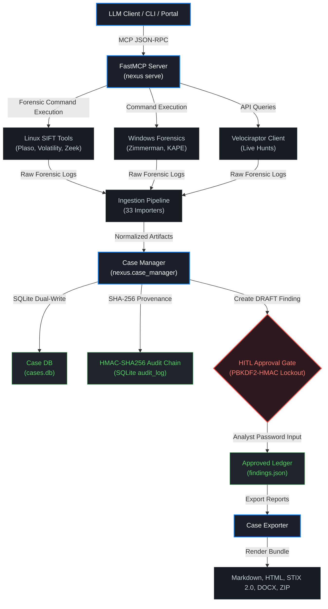

# DFIR-Nexus

<p align="center">
  
</p>

<p align="center">
  <strong>One audit chain. One process. AI-assisted. Examiner-approved.</strong>
</p>

<p align="center">
  <a href="LICENSE"></a>
  
  
  
</p>

> [!IMPORTANT]
> **Chain of Custody & Audit Integrity.** DFIR-Nexus enforces strict cryptographic data provenance. Every command executed through SIFT, Zimmerman, or Velociraptor is logged into a tamper-evident **HMAC-SHA256 audit ledger** in real time. To maintain forensic compliance, all draft findings must be verified and cryptographically signed using examiner passwords hashed with PBKDF2-HMAC (600,000 iterations). Automated AI agents are restricted to drafting findings and cannot authorize or alter forensic reports.

---

## Why DFIR-Nexus Exists

Digital Forensics and Incident Response (DFIR) routinely relies on a highly fragmented ecosystem of single-purpose command-line tools (such as Hayabusa, MFTECmd, chainsaw, Volatility, KAPE, and Velociraptor). Manually correlating tool outputs during high-pressure incidents introduces cognitive strain, compromises chain-of-custody, and limits auditability.

**DFIR-Nexus** solves this by providing a unified, secure, and cryptographically verified forensic integration layer. By exposing native forensic tools as **91 Model Context Protocol (MCP) endpoints** (91 on Windows, 88 on Linux), it allows LLM agents (e.g., Cursor, Claude Code, Cline) to orchestrate collections and analyze artifacts programmatically, while enforcing strict examiner boundaries, cryptographic proof-of-source, and human authorization.

---

## Architecture & Data Flow

DFIR-Nexus bridges LLM clients, host-native forensic tools, and the case database through a unified architecture:



**The architecture enforces an offline-first, loopback-only trust model:**
1. **MCP API (FastMCP)** — Exposes intent-level forensic capabilities to local LLM clients, ensuring arbitrary command strings cannot be executed.
2. **Ingestion & Normalization** — Reads raw files from SIFT and Zimmerman tool chains, parsing artifacts through 33 specialized importers.
3. **Case Ledger & Database** — Logs observations to SQLite and dual-writes a tamper-evident audit ledger using SHA-256 evidence hashing and HMAC-SHA256 block chaining.
4. **HITL Gateway** — Restricts finding approvals to human operators. The password hashing uses PBKDF2-HMAC (600,000 iterations) with a 3-strike lockout security mechanism.
5. **Report Exporter** — Exports validated case files as Markdown, HTML, STIX 2.0, DOCX, and ZIP bundles.

---

## Core Capabilities

| Dimension | Feature Set |
| :--- | :--- |
| **Case & Evidence** | SQLite-backed cases containing findings, evidence records, timeline events, and case TODOs. SHA-256 hashing at registration provides verifiable integrity at any time. |
| **Tamper Evidence** | Cryptographically chained HMAC-SHA256 audit ledger. Any attempt to modify command logs or findings breaks the chain verification. |
| **Hardened Gate** | PBKDF2-HMAC password validation with 600,000 iterations. Features a **3-strike lockout** of 15 minutes to block automated brute-forcing. |
| **Threat Intel** | Integrated lookups across 10 TI providers (ThreatFox, MalwareBazaar, URLhaus, Yaraify, MISP, OTX, Shodan, VT, AbuseIPDB, and CrowdStrike). |
| **Semantic RAG** | Search over **22,000+ IR records** (SANS posters, Sigma, LOLBAS, GTFOBins, and KAPE targets) using a local ChromaDB collection (downloaded on first use; ~600 MB). |
| **Live Orchestration** | Live target acquisition and collection via 10 built-in Velociraptor hunts (supports simulated mock client mode for offline testing). |
| **Pipeline Agents** | Multi-agent state machine containing 6 specialized sub-agents (alert, cloud, network, endpoint, synthesis, and timeline) to construct analysis loops. |

---

## Quickstart

### 1. Installation
Install native dependencies and the Python package:

```powershell
# Windows
.\setup-windows.ps1

# Linux / macOS
./setup-linux.sh

# Manual install with all optional integrations
pip install dfir-nexus[all]
```

### 2. Configuration & Onboarding
Initialize your examiner identity and case database:

```bash
# Configure examiner and set your HITL password
nexus config --examiner "Jane Doe"
nexus config --setup-password

# Quick onboarding (creates a case, hashes evidence, and launches the server)
nexus init "Case Name" --evidence /path/to/disk.raw
```

### 3. Running the Server & Dashboard
Expose the tools and interface locally:

```bash
# Boot the HTTP MCP server and Dashboard Portal on port 4508
nexus serve --http

# Open the Examiner Portal dashboard in your default browser
nexus portal
```

---

## Project Structure & Documentation

Detailed guidelines are grouped in the `Docs/` directory:

* 📚 **[Docs/guide.md](Docs/guide.md):** Step-by-step DFIR command guide.
* ⚙️ **[Docs/SETUP.md](Docs/SETUP.md):** Advanced installation, environment variables, and tool integration.
* 🔬 **[Docs/ARCHITECTURE.md](Docs/ARCHITECTURE.md):** High-level design, trust boundaries, and tool indexes.
* 💻 **[Docs/CLI.md](Docs/CLI.md):** Typer-based command-line reference.
* ❔ **[Docs/FAQ.md](Docs/FAQ.md):** Common operations and troubleshooting.
* 📝 **[Docs/CHANGELOG.md](Docs/CHANGELOG.md):** Project history and release notes.

---

## Verification & Testing

DFIR-Nexus includes a rigorous testing suite covering unit, script, functional wiring, and blocker regression tests (**586 total checks**).

```bash
# 1. Run all Pytest Unit Tests (155 tests including 32 blocker regressions)
pytest

# 2. Run Individual Script-Based Tests (219 tests)
python tests/test_knowledge.py
python tests/test_detection.py
python tests/test_ti.py
python tests/test_ingest.py
python tests/test_push.py
python tests/test_integration.py
python tests/test_portal.py
python tests/test_hunt_parser.py

# 3. Run the E2E Functional Audit (115 checks)
python tests/functional_audit.py
```

---

## License

Distributed under the MIT License. See [LICENSE](LICENSE) for details.

> Copyright (c) 2026 DFIR-Nexus contributors.
