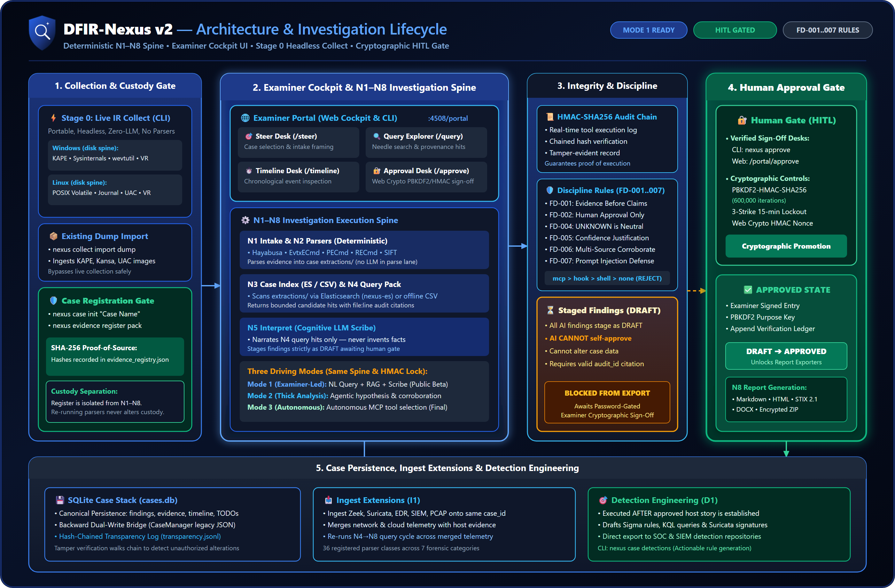

# DFIR-Nexus

<p align="center">
  
</p>

<p align="center">
  <strong>One audit chain. One process. AI-assisted. Examiner-approved.</strong>
</p>

<p align="center">
  <a href="LICENSE"></a>
  
  
  
</p>

Standalone release of the examiner-led DFIR capability developed within the [CADRE](https://github.com/Ganron007/CADRE) platform programme — consumes lab attack telemetry and host/network evidence for human-approved incident response.

> [!CAUTION]
> **Not a release. Do not download or install.** Version 2 is in active development. Do not clone this repository to run DFIR-Nexus. Do not `pip install dfir-nexus`. Do not run `setup-windows.ps1` or `setup-linux.sh`. There is no supported package, binary, or installer until v2 ships.
>
> This public tree is a **programme placeholder** so the product is visible in the CADRE platform. Treat everything below as design context, not an install guide. Commands, APIs, and documentation will change.

> [!IMPORTANT]
> **Chain of Custody & Audit Integrity.** DFIR-Nexus enforces strict cryptographic data provenance. Every command executed through SIFT, Zimmerman, or Velociraptor is logged into a tamper-evident **HMAC-SHA256 audit ledger** in real time. To maintain forensic compliance, all draft findings must be verified and cryptographically signed using examiner passwords hashed with PBKDF2-HMAC (600,000 iterations). Automated AI agents are restricted to drafting findings and cannot authorize or alter forensic reports.

---

## Why DFIR-Nexus Exists

Digital Forensics and Incident Response (DFIR) routinely relies on a highly fragmented ecosystem of single-purpose command-line tools (such as Hayabusa, MFTECmd, chainsaw, Volatility, KAPE, and Velociraptor). Manually correlating tool outputs during high-pressure incidents introduces cognitive strain, compromises chain-of-custody, and limits auditability.

**DFIR-Nexus** solves this by providing a unified, secure, and cryptographically verified forensic integration layer. By exposing native forensic tools as **103 Model Context Protocol (MCP) endpoints on Windows and 100 on Linux**, it allows LLM agents (e.g., Cursor, Claude Code, Cline) to orchestrate collections and analyze artifacts programmatically, while enforcing strict examiner boundaries, cryptographic proof-of-source, and human authorization.

---

## Architecture & Data Flow

DFIR-Nexus operates as a single, platform-aware FastMCP process with strict cryptographic trust boundaries, evidence provenance rules (FD-001..007), and a mandatory human authorization gate:

<p align="center">
  <a href="assets/dfir-nexus-architecture.svg">
    
  </a>
</p>

**Trust model (offline-first, loopback-only):**
1. **MCP API (FastMCP)** — Intent-level tools for LLM / CLI / Portal; no arbitrary shell.
2. **Collect + ingest** — Host tools plus **36** registered importers normalize evidence into the case.
3. **Case ledger** — SQLite case state dual-written with an **HMAC-SHA256** audit chain.
4. **Human gate** — Findings stay **DRAFT** until examiner approval (PBKDF2-HMAC, 3-strike lockout).
5. **Reports** — Approved cases export as Markdown, HTML, STIX 2.0/2.1, DOCX, and ZIP.

---

## Core Capabilities

| Dimension | Feature Set |
| :--- | :--- |
| **Case & Evidence** | SQLite-backed cases containing findings, evidence records, timeline events, and case TODOs. SHA-256 hashing at registration provides verifiable integrity at any time. |
| **Tamper Evidence** | Cryptographically chained HMAC-SHA256 audit ledger. Any attempt to modify command logs or findings breaks the chain verification. |
| **Hardened Gate** | PBKDF2-HMAC password validation with 600,000 iterations. Features a **3-strike lockout** of 15 minutes to block automated brute-forcing. |
| **Threat Intel** | Integrated lookups across 10 TI providers (ThreatFox, MalwareBazaar, URLhaus, Yaraify, MISP, OTX, Shodan, VT, AbuseIPDB, and CrowdStrike). |
| **Semantic RAG** | Search over **22,000+ IR records** (SANS posters, Sigma, LOLBAS, GTFOBins, and KAPE targets) using a local ChromaDB collection. Bring your own index, download the prebuilt release, or rebuild from your own sources; embedding model is operator-configurable (`NEXUS_RAG_MODEL`). |
| **Live Orchestration** | Live target acquisition and collection via 10 built-in Velociraptor hunts (simulated mock client mode for offline testing), plus `convert_pcap` for turning raw captures into ingestible JSON via tshark. |
| **Pipeline Agents** | Two analysis loops: an offline 6-agent heuristic graph (alert, cloud, network, endpoint, synthesis, timeline) and an **LLM-driven pipeline** (`nexus pipeline`) with four modes — **tools** (mandatory parsers only; no RAG, no LLM; `TOOL-RUN.md`), **coverage** (same lane, then LLM interprets), **design** (lane first, then ReAct may add corroboration), **interpret** (reuse a finished tool-run case; no re-parse). Coverage, design, and interpret stage DRAFT findings and pause at the human-approval gate. The LLM does not pick or skip parsers for artifacts that are present. |

---

## Quickstart

**Paused.** Installation, setup scripts, and `pip install` are not offered while v2 is in development. Do not download this repository to run it. Operator access is internal until a v2 release is published.

---

## Project Structure & Documentation

Detailed guidelines are grouped in the `Docs/` directory:

* 🧭 **[Docs/NEXUS-MODE.md](Docs/NEXUS-MODE.md):** Investigation loop (process → query → interpret → approve → export).
* 📚 **[Docs/guide.md](Docs/guide.md):** Step-by-step DFIR command guide.
* ⚙️ **[Docs/SETUP.md](Docs/SETUP.md):** Advanced installation, environment variables, and tool integration.
* 🔬 **[Docs/ARCHITECTURE.md](Docs/ARCHITECTURE.md):** High-level design, trust boundaries, and tool indexes.
* 💻 **[Docs/CLI.md](Docs/CLI.md):** Typer-based command-line reference.
* ❔ **[Docs/FAQ.md](Docs/FAQ.md):** Common operations and troubleshooting.

---

## Verification & Testing

DFIR-Nexus includes a rigorous testing suite covering unit, script, functional wiring, and blocker regression tests (**609 total checks**).

```bash
# 1. Run the pytest suite (290 tests, including blocker regressions)
pytest

# 2. Run Individual Script-Based Tests (202 tests)
python tests/test_knowledge.py
python tests/test_detection.py
python tests/test_ti.py
python tests/test_ingest.py
python tests/test_integration.py
python tests/test_portal.py
python tests/test_hunt_parser.py

# 3. Run the E2E Functional Audit (115 checks)
python tests/functional_audit.py
```

---

## Knowledge-base data — attribution & roadmap

The prebuilt **RAG index** (~22,000 IR records) and **Windows triage
baselines** currently offered through `forensic_rag_download()` /
`triage_download()` are built and published by
[Applied Incident Response](https://github.com/AppliedIR/sift-mcp) under the
**MIT License** (Copyright (c) 2026 AppliedIncidentResponse.com). Full credit
to the AppliedIR team for that corpus — DFIR-Nexus fetches those release
assets as-is and does not redistribute them.

**In progress:** we are building our own large-scale RAG and triage corpus
(expanded DFIR knowledge sources, lab-derived Windows baselines, and
detection-oriented records). As it lands, `forensic_rag_rebuild()` and the
`NEXUS_RAG_RELEASE_REPO` / `NEXUS_TRIAGE_RELEASE_REPO` overrides let you
point DFIR-Nexus at our releases — or at your own.

---

## License

Distributed under the MIT License. See [LICENSE](LICENSE) for details.

> Copyright (c) 2026 DFIR-Nexus contributors.
