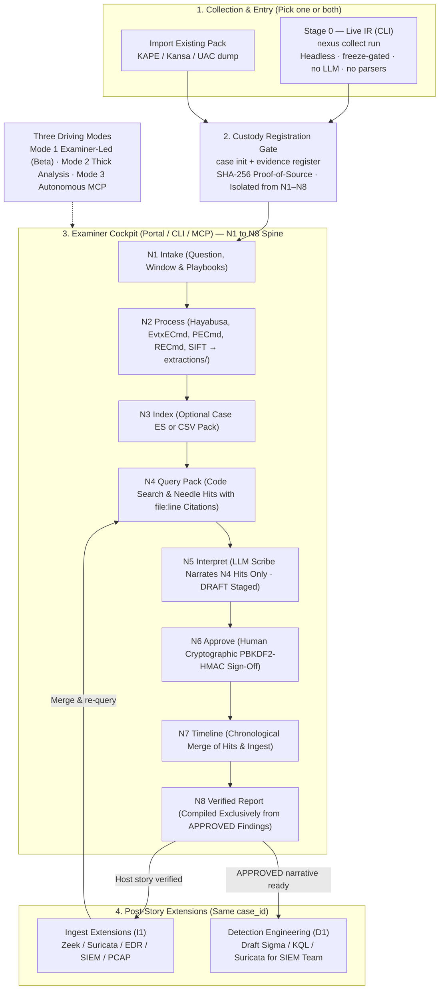

# DFIR-Nexus

<p align="center">
  
</p>

<p align="center">
  <strong>One audit chain. One process. AI-assisted. Examiner-approved.</strong>
</p>

<p align="center">
  <a href="LICENSE"></a>
  
  
  
</p>

Standalone release of the examiner-led DFIR capability developed within the [CADRE](https://github.com/Ganron007/CADRE) platform programme — consumes lab attack telemetry and host/network evidence for human-approved incident response.

> [!WARNING]
> **Version 2 is in active development.** The product is being re-architected into an enterprise-grade, deterministic forensic foundation with a phased AI roadmap:
> 
> - **What we are actively building & validating (v2 Mode 1 — Public Beta):** Authenticated, headless live IR collection (`nexus collect`, default `--profile disk`) over SSH/WinRM on current Windows 11 and modern Linux with zero model in the collection path; isolated evidence custody registration (SHA-256); deterministic parser execution (Hayabusa, Zimmerman, SIFT); code-based needle query scanning (N4); and an **examiner-led investigation cockpit** where an LLM acts strictly as an objective scribe over retrieved evidence hits, requiring cryptographic human sign-off (PBKDF2-HMAC) before findings become official.
> - **What we will ship in the final vision (Modes 2 & 3):** Once the deterministic spine is proven, we will layer **Mode 2 (Thick Cognitive Analysis)** for autonomous multi-source hypothesis corroboration and **Mode 3 (Full Autonomous Agentic MCP)** for direct agent tool execution over native MCP endpoints—strictly bounded by real-time HMAC-SHA256 audit chaining and `FD-001..007` forensic discipline rules.
> 
> This repository is an active **development snapshot**. Commands, APIs, and internal schemas are evolving toward the v2 milestone. Do not deploy this development branch in production environments.

> [!IMPORTANT]
> **Chain of Custody & Audit Integrity.** DFIR-Nexus enforces strict cryptographic data provenance. Every command executed through SIFT, Zimmerman, or Velociraptor is logged into a tamper-evident **HMAC-SHA256 audit ledger** in real time. To maintain forensic compliance, all draft findings must be verified and cryptographically signed using examiner passwords hashed with PBKDF2-HMAC (600,000 iterations). Automated AI agents are restricted to drafting findings and cannot authorize or alter forensic reports.

---

## Why DFIR-Nexus Exists

Digital Forensics and Incident Response (DFIR) routinely relies on a highly fragmented ecosystem of single-purpose command-line tools (such as Hayabusa, MFTECmd, chainsaw, Volatility, KAPE, and Velociraptor). Manually correlating tool outputs during high-pressure incidents introduces cognitive strain, compromises chain-of-custody, and limits auditability.

**DFIR-Nexus** solves this by providing a unified, secure, and cryptographically verified forensic integration layer:
- **Live IR Collection is a portable CLI** (`nexus collect`) — host-native, zero-model, no parsers on target, freeze-gated.
- **Evidence Registration** (`nexus case init` + `nexus evidence register`) establishes cryptographic chain-of-custody with SHA-256 evidence hashing before analysis starts.
- **Examiner Cockpit & CLI** provide an integrated workbench for the deterministic **N1–N8 Investigation Spine**: parsers extract structured CSVs, code searches for attack needles, an LLM scribe interprets retrieved hits, and human examiners cryptographically sign off before report compilation.

---

## Architecture & Investigation Lifecycle

Product flow (collect → register → N1–N8 → ingest → N4–N8 again → detection):  
See **[Docs/NEXUS-MODE.md](Docs/NEXUS-MODE.md)** for the full operator loop, and **[Docs/ARCHITECTURE.md](Docs/ARCHITECTURE.md)** for topology and tool index.

<p align="center">
  <a href="assets/dfir-nexus-architecture.svg">
    
  </a>
</p>

### Canonical Product Flow



**Trust model (offline-first, loopback-only):**
1. **Collect (CLI)** — Live IR pack on disk. No LLM, no parsers on target, freeze-gated. Stays portable; not a Portal harvest.
2. **Register** — `nexus case init` + `nexus evidence register`. Custody gate before analysis. Outside N1–N8.
3. **Examiner Cockpit / MCP** — Investigation desk for N1–N8, ingest, and detection. Intent-level tools; no arbitrary shell.
4. **Case ledger** — SQLite case state dual-written with an **HMAC-SHA256** audit chain.
5. **Human gate** — Findings stay **DRAFT** until examiner approval (PBKDF2-HMAC, 3-strike lockout).
6. **Reports** — Approved cases export as Markdown, HTML, STIX 2.0/2.1, DOCX, and ZIP.

---

## Examiner Cockpit (Web UI)

DFIR-Nexus features a web-based **Examiner Portal** (`nexus portal` on `http://127.0.0.1:4508/portal`) serving as the central investigation cockpit alongside the CLI and MCP APIs:

| Desk | Route | Capability |
| :--- | :--- | :--- |
| 🎯 **Case Steer** | `/portal/steer` | Active case switching, incident scope/question framing, and one-click N4 query pack re-runs. |
| 🔍 **Query Explorer** | `/portal/query` | Fast full-text needle searching across parsed CSVs and the case index with exact `file:line` provenance citations. |
| 🔐 **Approval Desk** | `/portal/approve` | Interactive review of staged `DRAFT` findings with client-side Web Crypto PBKDF2/HMAC challenge-response signing. |
| ⏱️ **Timeline Desk** | `/portal/timeline` | Integrated chronological inspection of host forensic events and ingested network telemetry. |
| 🗃️ **Evidence Desk** | `/portal/evidence` | SHA-256 evidence integrity validation and pack asset management. |
| 📋 **Case Summary** | `/portal` | Real-time counts of findings by state (Draft / Approved / Rejected), timeline events, and open investigator TODOs. |

---

## Storage & Search Architecture

DFIR-Nexus uses a dual-layer storage model separating immutable forensic state from high-scale log searching:

| Layer | Technology | Role & Behavior |
| :--- | :--- | :--- |
| **Forensic State & Ledger** | **SQLite (`cases.db`)** | **Permanent Single Source of Truth (SSoT)**. Stores case metadata, registered evidence SHA-256 hashes, finding states (`DRAFT` vs `APPROVED`), timeline events, investigator TODOs, and the tamper-evident cryptographic verification ledger (`transparency.jsonl`). Always local, zero-dependency, and offline-first. |
| **Case Search Backend** | **Elasticsearch (`nexus-es` / N3 Index)** | **High-Scale Query Acceleration Engine**. Indexes millions of raw parsed log lines from `extractions/` (EVTX, MFT, Prefetch, Zeek) for rapid N4 needle search. Does *not* store findings or replace SQLite. If Elasticsearch or Docker is not running, Nexus automatically falls back to local disk CSV/JSONL parsing with zero disruption. |

---

## Core Capabilities

| Dimension | Feature Set |
| :--- | :--- |
| **Case & Evidence** | SQLite-backed cases containing findings, evidence records, timeline events, and case TODOs. SHA-256 hashing at registration provides verifiable integrity at any time. |
| **Tamper Evidence** | Cryptographically chained HMAC-SHA256 audit ledger. Any attempt to modify command logs or findings breaks the chain verification. |
| **Hardened Gate** | PBKDF2-HMAC password validation with 600,000 iterations. Features a **3-strike lockout** of 15 minutes to block automated brute-forcing. |
| **Threat Intel** | Integrated lookups across 10 TI providers (ThreatFox, MalwareBazaar, URLhaus, Yaraify, MISP, OTX, Shodan, VT, AbuseIPDB, and CrowdStrike). |
| **Semantic RAG** | Search over **22,000+ IR records** (SANS posters, Sigma, LOLBAS, GTFOBins, and KAPE targets) using a local ChromaDB collection. Bring your own index, download the prebuilt release, or rebuild from your own sources; embedding model is operator-configurable (`NEXUS_RAG_MODEL`). |
| **Live IR pack (Stage 0)** | Authenticated **SSH / WinRM / local** collection — **CLI only** (portable, no UI). Ship spine (`--profile disk`): Windows **KAPE** `!SANS_Triage`/`!EZParser` + Sysinternals + PersistenceSniper + wevtutil + Velociraptor `IRTriage`; Linux **POSIX volatile + journalctl + UAC `ir_triage` + Velociraptor `LinuxIRTriage`**. Extra *collectors* (Kansa, DFIR-ORC, WinPmem/AVML, UAC `full`) stay on `--profile full` and **skip with a reason** if missing or broken. **Hayabusa / Suzaku / Chainsaw are N2 parsers**, not Stage 0. Live Velociraptor needs examiner `.env` MCP URL + key — [SETUP.md §2.6](Docs/SETUP.md#26-live-velociraptor-hunts-every-examiner-host). |
| **Three Nexus Modes** | Progressive investigation models driving the same N1–N8 spine, same `case_id`, and same HMAC lock:<br>• **Mode 1 (Examiner-Led / Public Beta):** Deterministic tool execution + code-based N4 query pack + LLM scribe & natural-language query assistant + manual examiner cryptographic sign-off.<br>• **Mode 2 (Thick Cognitive Analysis):** Same deterministic tools + cognitive LLM agent iteratively asking follow-up questions, building attack hypotheses, and corroborating across multiple artifact sources.<br>• **Mode 3 (Autonomous Agentic MCP):** Full autonomous agent tool execution over the 100+ native MCP endpoints, strictly bounded by real-time HMAC auditing and final human sign-off. |

---

## Quickstart

### 1. Installation
Install native dependencies and the Python package:

```powershell
# Windows
.\setup-windows.ps1

# Linux / macOS
./setup-linux.sh

# Manual install with all optional integrations
pip install dfir-nexus[all]
```

### 2. Configuration & operator loop

```bash
nexus config --examiner "Jane Doe"
nexus config --setup-password
nexus doctor                          # binaries + VR live status

# Stage 0 — collect only (CLI; freeze first)
nexus collect run --os windows --host <ip> --user <acct> --identity ~/.ssh/id

# Register (custody; separate from N1–N8)
nexus case init "IR host"
nexus evidence register <pack>

# N2 parsers, then investigation (CLI, Portal, or MCP)
nexus pipeline --mode tools --case <pack>
nexus pipeline --mode interpret --from-case INC-...
nexus portal                          # open Examiner Cockpit for query / approve / timeline / report
```

Existing dumps: `nexus collect import` then register. Mental model: [Docs/NEXUS-MODE.md](Docs/NEXUS-MODE.md).

### 3. Running the Server & Cockpit
Expose the tools and interface locally:

```bash
# Boot the HTTP MCP server and Dashboard Portal on port 4508
nexus serve --http

# Open the Examiner Portal dashboard in your default browser
nexus portal
```

---

## Project Structure & Documentation

Detailed guidelines are grouped in the `Docs/` directory:

* 🧭 **[Docs/NEXUS-MODE.md](Docs/NEXUS-MODE.md):** Operator loop — collect → register → process → query → interpret → approve → export.
* 📚 **[Docs/guide.md](Docs/guide.md):** Step-by-step DFIR command guide.
* ⚙️ **[Docs/SETUP.md](Docs/SETUP.md):** Advanced installation, environment variables, and tool integration.
* 🔬 **[Docs/ARCHITECTURE.md](Docs/ARCHITECTURE.md):** High-level design, trust boundaries, and tool indexes.
* 💻 **[Docs/CLI.md](Docs/CLI.md):** Typer-based command-line reference.
* ❔ **[Docs/FAQ.md](Docs/FAQ.md):** Common operations and troubleshooting.

---

## Verification & Testing

DFIR-Nexus includes a rigorous testing suite covering unit, script, functional wiring, and blocker regression tests (**609 total checks**).

```bash
# 1. Run the pytest suite (290 tests, including blocker regressions)
pytest

# 2. Run Individual Script-Based Tests (202 tests)
python tests/test_knowledge.py
python tests/test_detection.py
python tests/test_ti.py
python tests/test_ingest.py
python tests/test_integration.py
python tests/test_portal.py
python tests/test_hunt_parser.py

# 3. Run the E2E Functional Audit (115 checks)
python tests/functional_audit.py
```

---

## Knowledge-base data — attribution & roadmap

The prebuilt **RAG index** (~22,000 IR records) and **Windows triage
baselines** currently offered through `forensic_rag_download()` /
`triage_download()` are built and published by
[Applied Incident Response](https://github.com/AppliedIR/sift-mcp) under the
**MIT License** (Copyright (c) 2026 AppliedIncidentResponse.com). Full credit
to the AppliedIR team for that corpus — DFIR-Nexus fetches those release
assets as-is and does not redistribute them.

**In progress:** we are building our own large-scale RAG and triage corpus
(expanded DFIR knowledge sources, lab-derived Windows baselines, and
detection-oriented records). As it lands, `forensic_rag_rebuild()` and the
`NEXUS_RAG_RELEASE_REPO` / `NEXUS_TRIAGE_RELEASE_REPO` overrides let you
point DFIR-Nexus at our releases — or at your own.

---

## License

Distributed under the MIT License. See [LICENSE](LICENSE) for details.

> Copyright (c) 2026 DFIR-Nexus contributors.
