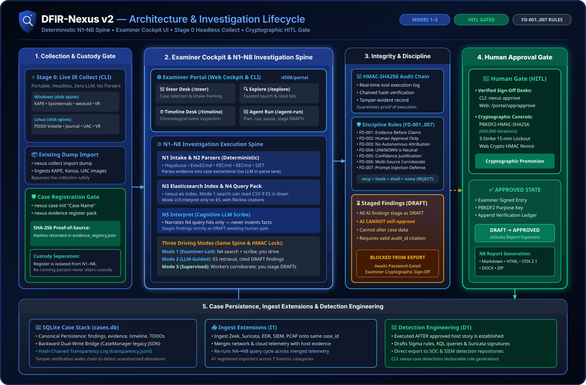

# DFIR-Nexus

<p align="center">
  
</p>

<p align="center">
  <strong>One audit chain. One process. AI-assisted. Examiner-approved.</strong>
</p>

<p align="center">
  <a href="LICENSE"></a>
  
  
  
</p>

Standalone release of the examiner-led DFIR capability developed within the [CADRE](https://github.com/Ganron007/CADRE) platform programme — consumes lab attack telemetry and host/network evidence for human-approved incident response.

> [!WARNING]
> **Version 2 is in active development.** DFIR-Nexus is a working product — live IR collection, custody-registered evidence, deterministic parsing, needle queries, and the examiner cockpit all run end-to-end today. But v2 is being rebuilt in the open: commands, APIs, and internal schemas can change — and anything can break — between commits. Do not deploy this branch in production environments.

> [!IMPORTANT]
> **Chain of Custody & Audit Integrity.** DFIR-Nexus enforces strict cryptographic data provenance. Every command executed through SIFT, Zimmerman, or Velociraptor is logged into a tamper-evident **HMAC-SHA256 audit ledger** in real time. To maintain forensic compliance, all draft findings must be verified and cryptographically signed using examiner passwords hashed with PBKDF2-HMAC (600,000 iterations). Automated AI agents are restricted to drafting findings and cannot authorize or alter forensic reports.

---

## Why DFIR-Nexus Exists

Digital Forensics and Incident Response (DFIR) routinely relies on a highly fragmented ecosystem of single-purpose command-line tools (such as Hayabusa, MFTECmd, chainsaw, Volatility, KAPE, and Velociraptor). Manually correlating tool outputs during high-pressure incidents introduces cognitive strain, compromises chain-of-custody, and limits auditability.

**DFIR-Nexus** solves this by providing a unified, secure, and cryptographically verified forensic integration layer:
- **Live IR Collection is a portable CLI** (`nexus collect`) — host-native, zero-model, no parsers on target, freeze-gated.
- **Evidence Registration** (`nexus case init` + `nexus evidence register`) establishes cryptographic chain-of-custody with SHA-256 evidence hashing before analysis starts.
- **Examiner Cockpit & CLI** provide an integrated workbench for the deterministic **N1–N8 Investigation Spine**: parsers extract structured CSVs, code searches for attack needles, an LLM scribe interprets retrieved hits, and human examiners cryptographically sign off before report compilation.

---

## Architecture & Investigation Lifecycle

Product flow (collect → register → N1–N8 → ingest → N4–N8 again → detection):  
See **[Docs/NEXUS-MODE.md](Docs/NEXUS-MODE.md)** for the full operator loop, and **[Docs/ARCHITECTURE.md](Docs/ARCHITECTURE.md)** for topology and tool index.

<p align="center">
  <a href="assets/dfir-nexus-architecture.svg">
    
  </a>
</p>

**Trust model (offline-first, loopback-only):**
1. **Collect (CLI)** — Live IR pack on disk. No LLM, no parsers on target, freeze-gated. Stays portable; not a Portal harvest.
2. **Register** — `nexus case init` + `nexus evidence register`. Custody gate before analysis. Outside N1–N8.
3. **Examiner Cockpit / MCP** — Investigation desk for N1–N8, ingest, and detection. Intent-level tools; no arbitrary shell.
4. **Case ledger** — SQLite case state dual-written with an **HMAC-SHA256** audit chain.
5. **Human gate** — Findings stay **DRAFT** until examiner approval (PBKDF2-HMAC, 3-strike lockout).
6. **Reports** — Approved cases export as Markdown, HTML, STIX 2.0/2.1, DOCX, and ZIP.

---

## Examiner Cockpit (Web UI)

DFIR-Nexus features a web-based **Examiner Portal** (`nexus portal` on `http://127.0.0.1:4508`) with three surfaces:

| Surface | Route | Role |
| :--- | :--- | :--- |
| **Landing page** | `/` | Product identity, inline health chips, entry points |
| **Case Dashboard** | `/dashboard` | Totals (cases, evidence, findings, processed), cases table, health bar |
| **React Cockpit** | `/portal/app/*` | Full investigation workspace (N1–N8 workflow) |

**React Cockpit pages:**

| Desk | Route | Capability |
| :--- | :--- | :--- |
| **Case Setup** | `/portal/app/case-setup` | Create a case and choose the investigation mode |
| 🎯 **Case Steer** | `/portal/app/steer` | Active case switching, intake, mode badge (mode is fixed at case creation), SSE chat streaming |
| 📄 **Briefing** | `/portal/app/briefing` | Question, run options, and the LLM run panel (Mode 1) |
| 🔍 **Explore** | `/portal/app/explore` | Faceted DSL search, type-aware hit columns, host facets, histogram, bookmarking |
| ⏱️ **Timeline** | `/portal/app/timeline` | Per-family lanes, type-aware event panels, brush-zoom |
| 🤖 **Agent Run** | `/portal/app/agent-run` | Mode-aware: multi-role lanes (plan → run → verify → stage) and the multi-agent Investigation Board |
| 🛠️ **Workbench** | `/portal/app/workbench` | Bookmark-to-DRAFT promotion |
| 🗃️ **Evidence** | `/portal/app/evidence` | Evidence registry, filesystem picker, parser-lane ledger |
| 📋 **Findings** | `/portal/app/findings` | Finding cards with status/confidence badges |
| ✅ **Approve** | `/portal/app/approve` | HMAC approval of DRAFT findings |
| 📊 **Report** | `/portal/app/report` | Report generation from APPROVED findings |
| 🔗 **Entities** | `/portal/app/entities` | Entity pivots across families |
| 🔏 **Transparency** | `/portal/app/transparency` | Audit-chain verification |
| 📋 **IOCs** | `/portal/app/iocs` | IOC list extracted from findings |
| ✅ **TODOs** | `/portal/app/todos` | Investigation TODO tracking |
| 📊 **Overview** | `/portal/app/` | In-cockpit dashboard with health strip |

---

## Storage & Search Architecture

DFIR-Nexus uses a dual-layer storage model separating immutable forensic state from high-scale log searching:

| Layer | Technology | Role & Behavior |
| :--- | :--- | :--- |
| **Forensic State & Ledger** | **SQLite (`cases.db`)** | **Permanent Single Source of Truth (SSoT)**. Stores case metadata, registered evidence SHA-256 hashes, finding states (`DRAFT` vs `APPROVED`), timeline events, investigator TODOs, and the tamper-evident cryptographic verification ledger (`transparency.jsonl`). Always local, zero-dependency, and offline-first. |
| **Case Search Backend** | **Elasticsearch (`nexus-es` / N3 Index)** | **High-Scale Query Acceleration Engine**. Indexes parsed log lines from `extractions/` for N4 needle search. Does *not* store findings or replace SQLite. The Mode 1 lane can produce CSVs with Elasticsearch down (examiner surfaces still work); interpretation and the Modes 2/3 agentic depths require the Elasticsearch digest and stop with an explicit reason when it is not the backend. |

---

## Core Capabilities

| Dimension | Feature Set |
| :--- | :--- |
| **Case & Evidence** | SQLite-backed cases containing findings, evidence records, timeline events, and case TODOs. SHA-256 hashing at registration provides verifiable integrity at any time. |
| **Tamper Evidence** | Cryptographically chained HMAC-SHA256 audit ledger. Any attempt to modify command logs or findings breaks the chain verification. |
| **Hardened Gate** | PBKDF2-HMAC password validation with 600,000 iterations. Features a **3-strike lockout** of 15 minutes to block automated brute-forcing. |
| **Threat Intel** | Integrated lookups across 10 TI providers (ThreatFox, MalwareBazaar, URLhaus, Yaraify, MISP, OTX, Shodan, VT, AbuseIPDB, and CrowdStrike). |
| **Semantic RAG** | Search over **22,000+ IR records** (SANS posters, Sigma, LOLBAS, GTFOBins, and KAPE targets) using a local ChromaDB collection. Bring your own index, download the prebuilt release, or rebuild from your own sources; embedding model is operator-configurable (`NEXUS_RAG_MODEL`). |
| **Live IR pack (Stage 0)** | Authenticated **SSH / WinRM / local** collection — **CLI only** (portable, no UI). Ship spine (`--profile disk`): Windows **KAPE** `!SANS_Triage`/`!EZParser` + Sysinternals + PersistenceSniper + wevtutil + Velociraptor `IRTriage`; Linux **POSIX volatile + journalctl + UAC `ir_triage` + Velociraptor `LinuxIRTriage`**. Extra *collectors* (Kansa, DFIR-ORC, WinPmem/AVML, UAC `full`) stay on `--profile full` and **skip with a reason** if missing or broken. **Hayabusa / Suzaku / Chainsaw are N2 parsers**, not Stage 0. Live Velociraptor needs examiner `.env` MCP URL + key — [SETUP.md §2.6](Docs/SETUP.md#26-live-velociraptor-hunts-every-examiner-host). |
| **Three Nexus Modes** | Progressive investigation models driving the same N1–N8 spine, same `case_id`, and same HMAC lock:<br>• **Mode 1 (LLM):** The merged examiner + LLM surface. Deterministic tool lane and code-based N4 query pack, Mode 1 full-run scribe, live steer chat (the LLM plans N4 queries that push down to the per-case ES index — field filters + ES-native aggregations — and answers with cited rows, per-stage timings and audit IDs), coverage/interpretation, and manual examiner cryptographic sign-off. Briefing + Steer Chat are the primary surfaces; interpretation does not run on a CSV fallback.<br>• **Mode 2 (Multi-role):** A LangGraph supervisor runs scoped **read-only** agent roles **one work order at a time** (director → evidence / correlation / pattern workers → verifier / refuter → synthesis) over the same case-gated evidence tools, with KB skill procedures, bounded budgets, follow-up corroboration and a no-new-evidence convergence stop. The examiner owns plan approval, live steering, pause / resume / **stop** and DRAFT staging (`nexus mode3 stage`); agents never stage or approve. Surfaces: **Agent Run** (`/portal/app/agent-run`) and `nexus mode3 plan|run|status|steer|pause|resume|stop|findings|stage|export`.<br>• **Mode 3 (Multi-agent):** A concurrent team — a supervisor (model-chosen seats) fans out evidence / correlation / pattern seats in one superstep; each publishes claims (audit-backed only) on a shared board; a join opens disputes and can re-dispatch, and synthesis stages nothing. Same read-only/audited/DRAFT-only rules. Surfaces: **Agent Run — Investigation Board** and `nexus mode4 run|status|board|steer|pause|resume|stop|stage|export`.<br>• **Examiner Cockpit:** React SPA at `/portal/app/*` — Case Setup, Overview, Briefing, Explore, Timeline, Steer Chat, Agent Run (mode-aware: multi-role lanes / multi-agent board), Workbench, Findings, Approval, Report, Evidence, Entities, Transparency, IOCs, TODOs. |

---

## Quickstart

### 1. Installation
Install native dependencies and the Python package:

```powershell
# Windows
.\setup-windows.ps1

# Linux / macOS
./setup-linux.sh

# Manual install with all optional integrations
pip install dfir-nexus[all]
```

### 2. Configuration & operator loop

```bash
nexus config --examiner "Jane Doe"
nexus config --setup-password
nexus doctor                          # binaries + VR live status

# Stage 0 — collect only (CLI; freeze first)
nexus collect run --os windows --host <ip> --user <acct> --identity ~/.ssh/id

# Register (custody; separate from N1–N8)
nexus case init "IR host"
nexus evidence register <pack>

# N2 parsers (deterministic; no LLM)
# NOTE: --case is the EVIDENCE path; --from-case reuses your registered case
# (without --from-case the pipeline auto-creates a new INC-* case)
nexus pipeline --mode tools --from-case <CASE-ID> --case <pack>

# Mode 1 — LLM query desk (examiner + scribe + steer chat)
nexus case ask --question "Was sdelete used to wipe files?"
nexus case select --hits 1,3,5 --title "sdelete wipe on WS01"
nexus case findings --status DRAFT
nexus approve --examiner <id> F-001            # HMAC sign-off
nexus report generate                          # N8 from APPROVED only

# Mode 2 — Multi-role runs / Mode 3 — Multi-agent runs
nexus mode3 plan -q "Trace RDP activity and USB device use"
nexus mode4 run  -q "Trace RDP activity and USB device use"

# Or open the Examiner Cockpit for query / approve / timeline / report
nexus portal
```

Existing dumps: `nexus collect import` then register. Mental model: [Docs/NEXUS-MODE.md](Docs/NEXUS-MODE.md).

### 3. Running the Server & Cockpit
Expose the tools and interface locally:

```bash
# Boot the HTTP MCP server and Dashboard Portal on port 4508
nexus serve --http

# Open the Examiner Portal dashboard in your default browser
nexus portal
```

---

## Project Structure & Documentation

Detailed guidelines are grouped in the `Docs/` directory:

* 🧭 **[Docs/NEXUS-MODE.md](Docs/NEXUS-MODE.md):** Operator loop — collect → register → process → query → interpret → approve → export.
* 📚 **[Docs/guide.md](Docs/guide.md):** Step-by-step DFIR command guide.
* ⚙️ **[Docs/SETUP.md](Docs/SETUP.md):** Advanced installation, environment variables, and tool integration.
* 🔬 **[Docs/ARCHITECTURE.md](Docs/ARCHITECTURE.md):** High-level design, trust boundaries, and tool indexes.
* 💻 **[Docs/CLI.md](Docs/CLI.md):** Typer-based command-line reference.
* ❔ **[Docs/FAQ.md](Docs/FAQ.md):** Common operations and troubleshooting.

---

## Verification & Testing

DFIR-Nexus includes a rigorous testing suite covering unit, script, functional wiring, and blocker regression tests. The last full pytest run (2026-09-25, after the multi-agent runtime, model supervisor, Investigation Board UI and the mode rename/merge) recorded **1334 passed / 3 skipped**, plus the script suites and the E2E functional audit.

```bash
# 1. Run the pytest suite (Mode 1/2/3 + audit regression tests)
pytest

# 2. Run the individual script-based test suites
python tests/test_knowledge.py
python tests/test_detection.py
python tests/test_ti.py
python tests/test_ingest.py
python tests/test_integration.py
python tests/test_portal.py
python tests/test_hunt_parser.py

# 3. Run the E2E functional audit
python tests/functional_audit.py
```

---

## Knowledge-base data — attribution & roadmap

The prebuilt **RAG index** (~22,000 IR records) and **Windows triage
baselines** currently offered through `forensic_rag_download()` /
`triage_download()` are built and published by
[Applied Incident Response](https://github.com/AppliedIR/sift-mcp) under the
**MIT License** (Copyright (c) 2026 AppliedIncidentResponse.com). Full credit
to the AppliedIR team for that corpus — DFIR-Nexus fetches those release
assets as-is and does not redistribute them.

**In progress:** we are building our own large-scale RAG and triage corpus
(expanded DFIR knowledge sources, lab-derived Windows baselines, and
detection-oriented records). As it lands, `forensic_rag_rebuild()` and the
`NEXUS_RAG_RELEASE_REPO` / `NEXUS_TRIAGE_RELEASE_REPO` overrides let you
point DFIR-Nexus at our releases — or at your own.

---

## License

Distributed under the MIT License. See [LICENSE](LICENSE) for details.

> Copyright (c) 2026 DFIR-Nexus contributors.
